# AgEnFK Autonomous Delivery — Implementation Plan

**Status:** Proposed (awaiting owner approval)
**Version:** 1.5
**Date:** 2026-09-02
**Source specification:** `AGENFK_AUTONOMOUS_DELIVERY_MASTER_SPEC.md` v1.0 (2026-09-02)
**Target repository:** `cglab-public/agenfk` (`main` @ `2b3761b6`, version 1.1.16, 1,084 commits)
**Working copy:** `/home/pin/projects/agenfk` (clone of `main`, dependencies installed, build green)
**Implementation client:** Claude Code 2.1.259 (primary), Codex CLI (installed, reviewer/fallback), Pi 0.84.4 (installed), Herdr 0.8.2 (installed)
**Plan shape:** 33 chained tasks, each bounded at **≤ 700k total model tokens**, grouped into 7 phases

---

## 0. How to use this document

This plan turns the Master Specification into an ordered chain of bounded implementation tasks. Each task is:

- **one AgEnFK item** (Story or Task under the `Autonomous Delivery` Epic), created before any code is edited, as the repository's own SDLC requires;
- **one branch + one worktree + one PR** against the fork, per spec §0.4;
- **bounded to ≤ 700k tokens**, with an explicit split trigger (§3);
- **planned first, then approved, then executed** — the implementing agent stops after producing its per-task plan (spec §0.5) unless the owner authorizes autonomous execution of that task;
- **done only with deterministic evidence** (spec §32): migrations upgrade a realistic prior database, tests pass, backwards-compatibility suite passes, docs/changelog updated, PR small enough to review.

Reading order for an implementing agent starting task `Tnn`:

1. §1 (what the repository actually is today — including contradictions with the spec);
2. §2 (environment and governance already in place);
3. §3 (token budget rules);
4. the task card for `Tnn` in §5, plus the cards of its direct dependencies;
5. Appendix A (the kickoff prompt template) — fill it with the task card's parameters.

Before any task starts, the operator selects the model and effort named on its card (§3.5 policy): that choice is made **before** the kickoff prompt is pasted, never by the implementing agent mid-task.

Nothing in this plan changes a public contract of AgEnFK without an ADR. Where the repository contradicts the specification, §1.3 records the contradiction and §8 lists the decision the owner must make.

---

## 1. Baseline findings (repository audit, 2026-09-02)

Three read-only audits were run over the clone (architecture inventory, Durable Execution gap analysis, external research). This section is the condensed result; it replaces the "AD0 inventory" only partially — AD0 (T02/T03) still produces the versioned, automated form of it.

### 1.1 What the repository is

| Area | Finding |
|---|---|
| Monorepo | npm workspaces, Node **≥ 22.5**, TypeScript strict everywhere, `tsc` CommonJS for `core`/`storage-sqlite`/`telemetry`/`cli`/`server`/`hub`; Vite + React 19 + Tailwind 4 for `ui`, `hub-ui`; `flow-editor` consumed as raw TS source |
| Packages | `core` (types, gatekeeper, default flow — zero deps), `storage-sqlite`, `telemetry`, `cli` (commander, axios), `server` (Express 5 + socket.io + stdio MCP server), `ui`, `flow-editor`, `create`, `hub` (Express 4, sqlite/pg), `hub-ui`, `brand` (tokens only) |
| Storage | **`node:sqlite` `DatabaseSync`** (built-in), not `better-sqlite3` as the docs say. WAL on. Single flat `SQLiteStorageProvider` class (`packages/storage-sqlite/src/index.ts`, 763 lines). Tables: `projects`, `items`, `snapshots`, `flows`, `hub_outbox`, `token_events`, `ingestion_state`, `prs`, `agent_runs`, `run_events`. Items store comments/history/tests/reviews as one JSON blob in `items.data` |
| Migrations | **None.** Schema is `CREATE TABLE IF NOT EXISTS` run on every `init()`; one ad-hoc `migrateFlowsTable()`; no version table; no general transaction helper (one hand-written `BEGIN/COMMIT`) |
| Domain | `Item` (EPIC/STORY/TASK/BUG, `Status` enum incl. PAUSED/BLOCKED), `Project {id,name,verifyCommand,flowId,projectRoot}`, `Flow/FlowStep {exitCriteria,isAnchor}`, `AgentRun/RunEvent` (worker transcript per step), `PauseSnapshot` (one per item, consumed on resume), `Pr/PrSizing`, `TokenEvent`, `HubEvent` |
| Server | `packages/server/src/server.ts` is **3,928 lines with ~90 routes registered inline**; no router modules. Realtime: socket.io events `items_updated`, `flow:updated`, `run:updated`, `run:event`, `project_switched`. Port auto-bump, written to `~/.agenfk/server-port`. Auth: local bind + `~/.agenfk/verify-token` (`x-agenfk-internal`) for privileged endpoints. `validateRuns` / `activeValidateRunByItem` are **in-memory Maps** |
| Workflow engine | `workflow_gatekeeper` (core) + `validate_progress` (`POST /items/:id/validate`, async runs, evidence as comments, `item.tests[]`, hub outbox events, `autoGitCommit` = `git add -A && git commit` inside the request handler on DONE) |
| CLI | commander; HTTP-only against the server. Top-level **`pause <platform>` / `resume <platform>`** exist (integration toggles, `index.ts:1276/1310`) alongside `pause-work <id>` / `resume-work <id>` (item snapshot). No `execution`, `project`, `scheduler`, `skills registry`, `verification`, `budget`, `release` namespaces (only `skills install/uninstall/status`, `release` routes for the framework itself) |
| Modes | Standard (`commands/agenfk.md`) and Deep (`commands/agenfk-deep.md`) are **prompt-driven**; Deep Mode's supervisor spawns one sub-agent per Flow step through the harness `task` tool, each gated by `agenfk gatekeeper` |
| Client enforcement | `scripts/install.mjs` installs PreToolUse/PostToolUse hooks (`bin/agenfk-mcp-enforcer.mjs`, `bin/agenfk-pr-hook.mjs`) plus rule bundles into each client. A **Pi extension already exists**: `bin/agenfk-pi-extension.ts`. OpenCode variants exist |
| GitHub / Hub | GitHub = import-only via `gh` CLI (3 routes). Hub = `hub_outbox` + `packages/server/src/hub/flusher.ts` (batches of 500, backoff, halts after 5×4xx); **no redaction layer** beyond remote-URL/DSN sanitising |
| Config / flags | env → `~/.agenfk/config.json` → defaults. **No feature-flag mechanism** |
| Tests | vitest, serial (`fileParallelism:false`), 241 test files (server 68, hub 63, cli 42, hub-ui 27, ui 21, core 10, storage 5, flow-editor 3, telemetry 2). Integration tests use supertest against the real Express app + temp SQLite. Coverage gate 80% on `core`/`storage-sqlite`/`server`/`hub`. **No browser e2e**. Mutation testing (StrykerJS) referenced by `.gitignore` |
| CI | `ci.yml` (npm ci → build → test), `codeql.yml`, `release.yml` (dispatch), `hub-image.yml` |
| Docs | `AFK_ARCHITECTURE.md`, `SDLC.md`, `HUB_ARCHITECTURE.md`, `SKILL.md`; `docs/` holds one test-scenario doc and screenshots; **no ADR directory**; `CHANGELOG.md` stops at 1.1.0-beta.2 while the package is at 1.1.16 |

### 1.2 Foundation gate (Durable Execution D1–D5) — current status

| Capability | Status | Closest existing analog |
|---|---|---|
| D1 first-class `Execution` attached to an Item | **MISSING** | `AgentRun` (transcript record, no lifecycle/ownership) |
| D2 typed `Checkpoint` + automatic checkpoints at boundaries | **MISSING** | `PauseSnapshot` (free-text, manual, one per item) |
| D3 one write `Lease` per Item; one writable execution per branch/worktree | **MISSING** | `activeValidateRunByItem` (in-memory, one endpoint) |
| D4 worktree binding + drift detection without destructive cleanup | **MISSING** | `branchName` string on top-level items |
| D5 portable resume packet + `agenfk execution resume` | **MISSING** | `resume-work <id>` (pops snapshot, restores status) |
| Companion `AGENFK_DURABLE_EXECUTION_MASTER_SPEC_2.md` | **MISSING from the repository and from this machine** | — |

Consequence: the spec's foundation gate (§5) fails today. AD4–AD6 cannot launch writable workers until Phase B (T04–T08) lands. The companion spec must be authored (T04) before D1–D5 code, because the master spec declares it "authoritative" and it does not exist.

### 1.3 Contradictions between the repository and the specification (to be recorded in ADRs / implementation notes, spec §0)

| # | Contradiction | Impact on plan |
|---|---|---|
| C1 | Docs say `better-sqlite3`; code uses `node:sqlite` (`DatabaseSync`, sync API, Node ≥ 22.5) | Migration framework and transaction helper (T03) target `node:sqlite`; docs corrected in T02 |
| C2 | Spec §24.1 requires transactional, backwards-compatible migrations; repository has no migration framework | T03 introduces `schema_version` + ordered, transactional migrations (schema change → owner approval, §8 D2) |
| C3 | Spec §5.1 says `agenfk pause/resume <platform>` exist at top level — confirmed; but the repo also has `pause-work/resume-work` (items). Three pause/resume vocabularies once `execution`/`project` namespaces land | T03 adds collision tests; T08 maps `pause-work`/`resume-work` through Durable Execution without renaming them |
| C4 | Spec §31 suggests new packages (`orchestrator`, `runner-herdr`, `harness-adapters`, `skill-registry`, `verification`); repository convention is a small set of packages with `server.ts` monolith | ADR-0001 (T02) decides: new packages for `orchestrator`, `verification`, `skill-registry`, `runner-herdr`, `harness-adapters`; **new server routes go in `packages/server/src/routes/<feature>.ts` router modules**, not appended to `server.ts` |
| C5 | Spec §2.4/§11.6: completion only via structured events + evidence; repo's `autoGitCommit` runs `git add -A && git commit` inside the validate handler | Parallel worktrees would race. T07/T25 make auto-commit worktree-scoped and execution-aware; never `git add -A` across an unbound tree |
| C6 | Spec §23.3 events / §25.3 privacy pipeline (`detect → redact → hash → persist`); Hub outbox has no redaction layer | New event types must pass through a redaction policy before entering `hub_outbox` (T05 introduces `RedactedOutboxWriter`; T32 adversarial tests) |
| C7 | Spec requires per-execution identity for callbacks (§14); repo has only a shared `verify-token` | T19 introduces execution-scoped short-lived tokens; `verify-token` stays for existing CLI paths |
| C8 | `CONTRIBUTING.md` says conventional commits; server auto-commits `close(<type>): <title> [<id>]`; `CHANGELOG.md` is stale | Every task updates `CHANGELOG.md` (spec §32 + global rules); T02 documents both commit forms |
| C9 | Spec §13.4 wants design/visual evidence; repo has no browser e2e | T26 adds gate adapter interfaces; Playwright is optional and added only in a project's Verification Profile, never as a core dependency |
| C10 | `AGENFK_COMPARISON.md` states AgEnFK "does not address session lifecycle" | This is exactly the gap Phase B closes; document the change of scope in ADR-0003 |

### 1.4 Baseline verification

| Check | Result |
|---|---|
| `npm ci` | exit 0 |
| `npm run build` | exit 0 (all packages) |
| `npm test` (root run; `cli.test.ts` and `ui` excluded by config) | exit 0 — 219 files, 2,368 tests passed, 1 skipped, 407 s wall time (serial) |
| Coverage gate (80% on `core`/`storage-sqlite`/`server`/`hub`) | enforced by `vitest.config.ts`; every task must keep it |

---

## 2. Environment and governance setup

### 2.1 Already done in this working copy

| Item | State |
|---|---|
| Clone of `cglab-public/agenfk` `main` into `/home/pin/projects/agenfk` | done; the master spec and this plan sit untracked at the root |
| **Fork** `eduardopin/agenfk` (public; git remote `fork`, `origin` stays upstream) | done 2026-09-02 — upstream license is **ISC** (CG/lab), which permits forks and derivative versions with the copyright + permission notice kept; `CONTRIBUTING.md` itself asks for fork-based PRs |
| Herdr 0.8.2 (`~/.local/bin/herdr`, Apache-2.0) and Pi 0.84.4 (`@earendil-works/pi-coding-agent`, MIT) | installed 2026-09-02; Herdr server not started yet (`herdr status` → not running); `herdr api schema --json` works offline |
| Dependencies (`npm ci`) and full build | done, green |
| Claude Code plugins (free, project scope, written to `.claude/settings.json`, which the repo gitignores) | `superpowers`, `tdd-workflows`, `database-migrations`, `javascript-typescript`, `block-no-verify`, `unit-testing`, `security-scanning`, `pr-review-toolkit`, `dependency-management`, `context-management`, `c4m` — plus the 7 global baseline plugins (`commit-commands`, `github`, `cost-guard`, `gate-and-ship`, `before-you-build`, `security-guidance`, `typescript-lsp`) |
| Local hooks for the working copy | see §2.4 |

### 2.2 Pending before T01 can finish (owner actions or approvals)

| Item | Why | Command / note |
|---|---|---|
| **Courtesy notice to upstream** (optional, not required by ISC) | GitHub Discussions are disabled on the upstream repo; `CONTRIBUTING.md` points to issues with the `question` label; org contact `opensource@cglab.com` | open one issue describing the Autonomous Delivery fork and the intent to send PRs, or email; keep the `LICENSE` file and the CG/lab copyright in the fork |
| ~~**Trust the workspace** in an interactive Claude Code session~~ — *done, verified in T01* | project-scoped `.claude/settings.json` (plugins, hooks) is ignored until `hasTrustDialogAccepted` is set for `/home/pin/projects/agenfk` | accepted; the Appendix D skill-listing check reports 46 skills, 19 of them from the project-scoped plugins |
| Start **Herdr** server once and capture its API schema | MVP runtime (AD6) is installed; T20 contract tests need the schema snapshot | `herdr` (launches the persistent session) or `herdr status`; `herdr api schema --json > docs/runtime/herdr-api-schema.json` (protocol 20) |
| Confirm **Pi** provider config for LiteLLM (D8) | Pi 0.84.4 installed; `pi --provider <name> --model <pattern>`, `pi auth`, `pi install <extension>` exist | `pi auth` and `pi --help`; document in `docs/runtime/pi.md` |
| Codex CLI | already installed (`~/.local/bin/codex`); used as independent reviewer (AD6 fixtures, AD7 separation of duties) | — |
| LiteLLM | only needed from T30 (AD11); free, self-hosted | `pip install litellm` or Docker image, when T30 starts |
| **Dogfood AgEnFK** — *done 2026-09-03* | the repo's SDLC forbids editing files without an active item and a gatekeeper pass | framework **1.1.17-beta.5** installed (`~/.agenfk`, server on port 3001, DB `~/.agenfk-system/.agenfk/db.sqlite`); project **`agenfkplus`** = `ef5f9e00-b80d-4f9a-9a82-846479156f2d` exists but is **empty and has no `verifyCommand`** — T01 sets it and creates the item tree |

### 2.3 Branch, item and PR conventions for this plan

- Epic: `Autonomous Delivery (AGENFK_AUTONOMOUS_DELIVERY_MASTER_SPEC v1.0)`. One Story per phase-delivery (AD0, DE, AD1 … AD13). One Task (or Bug) per `Tnn`.
- Branch per task: `feature/<item-id>_t<nn>-<slug>` (the repo recently removed forced prefixes; keep the item id in the name for traceability). Never commit to `main`.
- Worktree per task: `git worktree add ../agenfk-wt/t<nn> -b feature/...` — the plan itself is the first consumer of the isolation rule it implements.
- Commits: conventional prefix in human commits (`feat(orchestrator): …`); the server's `close(<type>): <title> [<id>]` auto-commit remains as is.
- PR per task, opened from the fork, body listing: spec sections implemented, migrations added, tests added, compatibility risks, contradictions found, token usage.
- Version bump is **not** part of a task; the owner cuts releases with the repo-private release commands.

### 2.6 Execution model — Herdr + Claude Code + Pi + AgEnFK (confirmed 2026-09-03)

The chain is executed on the same stack the product is being built to orchestrate. This is deliberate: every task dogfoods the runtime and harness assumptions that AD6 later formalizes.

| Layer | What runs it | Notes |
|---|---|---|
| Runtime | **Herdr 0.8.2**, server running, socket `~/.config/herdr/herdr.sock`, protocol 20 | one workspace `agenfk` on `/home/pin/projects/agenfk`; one pane per task, one extra pane for the reviewer |
| Primary harness | **Claude Code 2.1.259** in a Herdr pane | model and effort per the task card (§3.5); `herdr integration install claude` gives Herdr session identity for restore |
| Secondary harness | **Pi 0.84.4** (`@earendil-works/pi-coding-agent`, MIT), provider `anthropic` **ready** | `herdr integration install pi` makes Pi a Herdr lifecycle authority (semantic idle/working/blocked, not screen scraping) — the strongest signal available for T20/T21 |
| Independent reviewer | **Codex CLI** or Pi, in a separate pane | separation of duties (spec §13.3): the harness that authored a change is never its sole reviewer |
| Control plane | **AgEnFK 1.1.17-beta.5** installed globally; server on port 3001; DB `~/.agenfk-system/.agenfk/db.sqlite`; project `agenfkplus` (`ef5f9e00-b80d-4f9a-9a82-846479156f2d`) | the board is authoritative: no file is edited without an active item and a `agenfk gatekeeper` pass |

Consequences for the plan:

- **Every task runs in its own Herdr pane**, started from the workspace root, so panes map 1:1 to executions once AD6 lands and the mapping can be replayed from real usage.
- **Pi is a first-class execution path, not a future adapter.** Any task may be executed on Pi instead of Claude Code when the card's model is available there; the card's effort guidance then applies to the equivalent Pi setting, and the difference is recorded in the handoff.
- **T20/T21 gain live fixtures for free**: the Herdr integration state, the pane lifecycle events and the Pi session files produced while running T01–T19 are exactly the evidence those tasks need — capture them in `docs/runtime/` as they occur rather than reconstructing them later.
- **Herdr's own worktree commands are observed, not adopted**: from T02 onward each task gets a git worktree; whether Herdr creates it or AgEnFK does is decided in T07, and until then the plain `git worktree` commands in §2.3 are used so the baseline stays reproducible without Herdr.

### 2.4 Local hooks (`.claude/settings.json`, project scope, not versioned)

Deterministic guardrails per the owner's global protocol: a `SessionStart` branch banner, a `PreToolUse` guard that runs the test suite before any `git push`, and the `block-no-verify` plugin hook. Lint is not wired because the root has no `lint` script; per-package `tsc` runs through `npm run build`.

---

## 3. Token budget model (why 700k, how it is measured, when to split)

**Unit of account:** total model tokens consumed by the implementing Claude Code session(s) for one task — input + cached input + output, as reported by `/cost` at the end of the session and by `agenfk tokens list` (the repository already ingests per-turn token events). Subagents count toward the same task.

**Empirical sizing assumptions** (this repository, Sonnet/Opus-class models, cache on):

| Work unit | Typical cost |
|---|---|
| Session overhead: read `CLAUDE.md`, spec sections, task card, existing code paths | 80k–150k |
| One new domain module (types + Zod schema + unit tests, ~350 LOC) | 25k–40k |
| One migration + repository methods + upgrade test | 35k–50k |
| One route group (5–8 routes, validation, supertest tests) | 50k–80k |
| One CLI command group (3–5 subcommands + tests) | 35k–50k |
| One UI panel/view with RTL tests | 80k–130k |
| One cross-package integration or chaos test | 20k–35k |
| Docs, ADR, changelog per task | 15k–30k |

A 700k envelope therefore fits roughly **1,200–2,000 new lines (source + tests) across ≤ 25 files**. Estimates in §4 are planning numbers, not commitments; the spec's own bound (materially under 1M per delivery, §0.10) is respected with margin.

**Rules:**

1. **Plan first.** Each task begins in Plan Mode; the plan lists files, migrations, tests, risks. Planning is budgeted at ≤ 10% of the envelope.
2. **Split trigger.** If the session crosses **450k tokens before tests are green**, or **550k** at any point, the agent must: commit WIP on the task branch, write `docs/plans/handoff-t<nn>.md` (what is done, what remains, failing tests), update the AgEnFK item with a `pause-work` snapshot, and propose a `Tnn-b` continuation task. Never run past 700k.
3. **Context hygiene.** Use subagents for exploration; never read whole large files (`server.ts`) into the main session; keep test output trimmed. `/clear` between tasks.
4. **Measure and record.** The PR body carries the `/cost` total and the split decision, so the model in this section can be recalibrated after the first three tasks (T01–T03).

### 3.5 Model and effort routing (per task)

Every task card and every §4 table now carries a recommended **model**, **effort** and an **API-equivalent cost**. The routing follows the owner's global rule (simple → Haiku, standard implementation → Sonnet, architecture and hard debugging → Opus) and adds one tier above it for the three places where a subtle bug is most expensive.

| Tier | Model | Effort | When |
|---|---|---|---|
| Foundation-critical | **Claude Fable 5.1** (`claude-fable-5-1`) | `max` (code) / `high` (documents) | concurrency and safety kernels whose bugs corrupt state or code: leases + worktrees (T07), scheduler transaction (T18), autonomy policy engine (T31); the companion spec (T04) |
| Architecture / security-sensitive | **Claude Opus 5** (`claude-opus-5`) | `xhigh` (`max` for ADR-only tasks) | ADRs, storage foundation, graph/rule engines, token/callback auth, external runtime integration, supply-chain and verification code, adversarial suites |
| Standard implementation | **Claude Sonnet 5** (`claude-sonnet-5`) | `xhigh` for state machines and services, `high` for routes/CLI/UI | well-specified entities, routes, CLI groups, UI panels, data-driven registries |
| Mechanical / exploration | **Claude Haiku 4.5** (`claude-haiku-4-5`) | `low` | subagent exploration (`Explore`), file inventories, log triage, fixture generation — never the main session of a task (200K context) |

Standing rules:

- **Subagents inside a task**: exploration and inventory subagents run on Haiku 4.5 or Sonnet 5 at `low`; a reviewer subagent runs on Sonnet 5 at `high`; never spawn a Fable 5.1 subagent.
- **Second opinion for Fable-tier tasks**: before merging T07, T18 and T31, run an independent review on a different model family (Codex CLI is installed) in addition to `pr-review-toolkit` — the same separation-of-duties rule the product enforces.
- **Effort is set per session**: `/model` and `/effort` in Claude Code, or `model` / `effortLevel` in the project `.claude/settings.json` for the duration of a task. `xhigh` is the Claude Code default for coding; drop to `high` only when a task is on the standard tier and its tests are already green.
- **Do not downgrade to save cost mid-task.** If a Sonnet 5 session stalls twice on the same failure, checkpoint and restart the remaining work on Opus 5 at `xhigh` — the escalation ladder the product itself uses (spec §18.5).
- **Cost column assumptions**: API list prices (Fable 5.1 $10/$50, Opus 5 $5/$25, Sonnet 5 $2/$10, Haiku 4.5 $1/$5 per MTok; Fable cache reads $0.25/MTok), token mix 15% uncached input, 75% cached reads, 10% output → blended $6.69 / $3.63 / $1.45 / $0.73 per 1M tokens. On a Claude Code subscription these are usage-limit equivalents, not invoices. The figures are sensitive to the output share: at 20% output instead of 10%, multiply every USD figure by ≈ 1.7. Recalibrate after T03 from real `/cost` reports (decision D11).

| Model | Tasks | Tokens | ≈ USD |
|---|---|---|---|
| Opus 5 | 15 | ≈ 7.9M | ≈ 29 |
| Fable 5.1 | 4 | ≈ 2.1M | ≈ 14 |
| Sonnet 5 | 14 | ≈ 6.7M | ≈ 10 |
| **MVP (T01–T28)** | 28 | ≈ 14.5M | **≈ 44** |
| **v1 (T01–T32)** | 32 | ≈ 16.5M | **≈ 52** |
| All (T01–T33) | 33 | ≈ 16.7M | ≈ 53 |

---

## 4. Task chain overview

Legend: **Env** = tokens envelope (k); **Model / Effort** = recommended Claude Code model and effort (§3.5); **≈ USD** = API-equivalent cost at the §3.5 blended rates; **Gate** = approval required before execution starts (`plan` = task plan approval per spec §0.5; `ADR` = an ADR must be approved; `schema` = schema change needs explicit approval per the owner's global rules).

### 4.1 Phase A — Bootstrap and AD0 (foundation audit and compatibility contract)

| ID | Delivery | Title | Depends on | Env | Gate | Model | Effort | ≈ USD |
|---|---|---|---|---|---|---|---|---|
| T01 | — | Bootstrap: fork, dogfooding items, harness installs, hooks | — | 120 | plan | Sonnet 5 | medium | 0 |
| T02 | AD0-a | Inventory doc, ADR-0001/0002/0003, contradictions log, feature-flag & config skeleton, `/capabilities` | T01 | 400 | plan, ADR | Opus 5 | xhigh | 1 |
| T03 | AD0-b | Migration framework, foundation-gate service, `agenfk project doctor`, CLI collision tests, backwards-compat suite | T02 | 600 | plan, schema | Opus 5 | xhigh | 2 |

### 4.2 Phase B — Durable Execution foundation (D1–D5)

| ID | Delivery | Title | Depends on | Env | Gate | Model | Effort | ≈ USD |
|---|---|---|---|---|---|---|---|---|
| T04 | DE0 | Author `AGENFK_DURABLE_EXECUTION_MASTER_SPEC_2.md` (D1–D5 contracts, acceptance suites) | T03 | 300 | ADR/spec approval | Fable 5.1 | high | 2 |
| T05 | D1 | `Execution` entity, repository, API, events, `agenfk execution history` | T04 | 500 | plan, schema | Sonnet 5 | xhigh | 1 |
| T06 | D2 | Typed `Checkpoint`, automatic checkpoints at workflow boundaries, `PauseSnapshot` compatibility | T05 | 550 | plan, schema | Sonnet 5 | xhigh | 1 |
| T07 | D3+D4 | `Lease` (expiry/heartbeat), `WorktreeBinding`, drift detection without destructive cleanup | T06 | 650 | plan, schema | Fable 5.1 | max | 4 |
| T08 | D5 | `ResumePacket`, `agenfk execution resume`, `pause-work`/`resume-work` mapped through DE, D1–D5 acceptance suites | T07 | 550 | plan | Opus 5 | xhigh | 2 |

### 4.3 Phase C — Contract, planning, readiness, scheduler (AD1–AD5; no harness launched)

| ID | Delivery | Title | Depends on | Env | Gate | Model | Effort | ≈ USD |
|---|---|---|---|---|---|---|---|---|
| T09 | AD1-a | Project Contract schema (Zod), tables, source artifact hashing, extraction interface + mocked extractor, idempotent ingest | T08 | 500 | plan, schema | Sonnet 5 | high | 1 |
| T10 | AD1-b | `/v1/project-contracts`, `agenfk project ingest` / `contract show`, UI contract read view, events | T09 | 450 | plan | Sonnet 5 | high | 1 |
| T11 | AD2-a | Clarification questions, assumptions, contract state machine, immutable versions + diff, `Approval` entity, CLI | T10 | 550 | plan, schema | Opus 5 | xhigh | 2 |
| T12 | AD2-b | UI approval surface, harness-driven extraction/clarification slash commands, `spec-analyst` prompt | T11 | 450 | plan | Sonnet 5 | high | 1 |
| T13 | AD3-a | Plan entity/versioning, dependency edges, requirement refs, deterministic validator, `plan validate` | T12 | 600 | plan, schema | Opus 5 | xhigh | 2 |
| T14 | AD3-b | Plan proposal service (harness-driven), plan approval, impact/stale markers, UI plan review | T13 | 550 | plan | Sonnet 5 | xhigh | 1 |
| T15 | AD4-a | Readiness engine (12 predicates, reasons, incremental), `/v1/readiness`, `scheduler explain` / `tick --dry-run` | T14 | 500 | plan | Opus 5 | xhigh | 2 |
| T16 | AD4-b | Autonomous Delivery dashboard shell, card orchestration panel, dependency visualization, feature-off tests | T15 | 550 | plan | Sonnet 5 | high | 1 |
| T17 | AD5-a | `OrchestrationRun` entity/state machine, lifecycle API/CLI (`run/status/pause/resume/cancel/doctor`), basic caps | T16 | 500 | plan, schema | Sonnet 5 | xhigh | 1 |
| T18 | AD5-b | Scheduler transaction, ordering, WIP/fairness, dispatch outbox, dry-run worker adapter, restart/recovery tests | T17 | 650 | plan, schema | Fable 5.1 | max | 4 |

### 4.4 Phase D — Runtime, harness adapters, agent profiles (AD6–AD7)

| ID | Delivery | Title | Depends on | Env | Gate | Model | Effort | ≈ USD |
|---|---|---|---|---|---|---|---|---|
| T19 | AD6-a | `RuntimeAdapter`/`HarnessAdapter` interfaces, Execution Packet, execution-scoped callback auth, heartbeat states, local-process test runtime | T18 | 550 | plan, schema | Opus 5 | xhigh | 2 |
| T20 | AD6-b | Herdr `RuntimeAdapter` (`packages/runner-herdr`), Claude Code `HarnessAdapter`, first real worker launch in a worktree | T19 | 600 | plan | Opus 5 | xhigh | 2 |
| T21 | AD6-c | Pi `HarnessAdapter`, loss detection and recovery paths, portable checkpoint fallback, static Claude→Pi handoff, A0–A2 side-effect enforcement, Codex fixtures | T20 | 600 | plan | Opus 5 | xhigh | 2 |
| T22 | AD7 | Agent Profile registry + catalog, capability/side-effect requirements, role-to-flow, separation of duties, profile version in evidence | T21 | 500 | plan, schema | Sonnet 5 | high | 1 |

### 4.5 Phase E — Skills governance, verification, integration and release candidate (AD8–AD10) — **MVP cut line after T28**

| ID | Delivery | Title | Depends on | Env | Gate | Model | Effort | ≈ USD |
|---|---|---|---|---|---|---|---|---|
| T23 | AD8-a | Skill package entities, immutable source/hash capture, inspect/admit/quarantine, static checks + golden-eval interfaces | T22 | 550 | plan, schema | Opus 5 | xhigh | 2 |
| T24 | AD8-b | Project skill lock, `verify-lock`, worker skill snapshot, revocation behavior, permission-profile enforcement | T23 | 450 | plan | Sonnet 5 | xhigh | 1 |
| T25 | AD9-a | Verification Profile/Run entities, layered gates, deterministic runner, affected/full selection, integration with `validate_progress` | T24 | 600 | plan, schema | Opus 5 | xhigh | 2 |
| T26 | AD9-b | Bounded repair policy, flaky/error/timeout distinction, UI evidence surface, gate adapter interfaces, chaos tests | T25 | 500 | plan | Sonnet 5 | xhigh | 1 |
| T27 | AD10-a | Integration queue/state, isolated integration worktree, dependency-aware order, conflict items, idempotency keys | T26 | 600 | plan, schema | Opus 5 | xhigh | 2 |
| T28 | AD10-b | Release Candidate entity, requirement coverage evaluator, release gates on RC tree, artifact slots, acceptance API/CLI/UI | T27 | 550 | plan, schema | Sonnet 5 | xhigh | 1 |

### 4.6 Phase F — FinOps, routing, security hardening (AD11–AD12) — **production-ready v1 cut line after T32**

| ID | Delivery | Title | Depends on | Env | Gate | Model | Effort | ≈ USD |
|---|---|---|---|---|---|---|---|---|
| T29 | AD11-a | Hierarchical budgets, reservations, policy thresholds, cost ledger, `agenfk budget`, token-event attribution | T28 | 500 | plan, schema | Sonnet 5 | xhigh | 1 |
| T30 | AD11-b | LiteLLM route correlation, Capability Contract + pre-launch compatibility, fallback/escalation, stagnation detection, unknown-pricing policy | T29 | 500 | plan | Opus 5 | xhigh | 2 |
| T31 | AD12-a | Side-effect registry/enforcement, A0–A4 policy engine, approval expiry/revocation, network/filesystem/tool policies, scoped credential hooks | T30 | 550 | plan, schema | Fable 5.1 | max | 4 |
| T32 | AD12-b | Adversarial suites (prompt injection, secret redaction, callback replay, path traversal, command injection), security dashboard, incident events | T31 | 450 | plan | Opus 5 | xhigh | 2 |

### 4.7 Phase G — Corporate Hub fleet scheduling (AD13, post-MVP)

| ID | Delivery | Title | Depends on | Env | Gate | Model | Effort | ≈ USD |
|---|---|---|---|---|---|---|---|---|
| T33 | AD13-0 | Distributed-execution ADR + threat model (documents only; implementation tasks defined after approval) | T32 + proven usage | 250 | ADR | Opus 5 | max | 1 |

### 4.8 Totals

| Scope | Tasks | Estimated tokens |
|---|---|---|
| Phase A (bootstrap + AD0) | T01–T03 | ≈ 1.1M |
| Phase B (Durable Execution) | T04–T08 | ≈ 2.6M |
| Phase C (AD1–AD5) | T09–T18 | ≈ 5.3M |
| Phase D (AD6–AD7) | T19–T22 | ≈ 2.3M |
| Phase E (AD8–AD10) | T23–T28 | ≈ 3.3M |
| **MVP (T01–T28)** | 28 | **≈ 14.5M** |
| Phase F (AD11–AD12) | T29–T32 | ≈ 2.0M |
| **Production-ready v1 (T01–T32)** | 32 | **≈ 16.5M** |
| Phase G (AD13 ADR only) | T33 | ≈ 0.25M |

### 4.9 Dependency graph

```mermaid
flowchart LR
  subgraph A[Phase A · AD0]
    T01 --> T02 --> T03
  end
  subgraph B[Phase B · Durable Execution]
    T04 --> T05 --> T06 --> T07 --> T08
  end
  subgraph C[Phase C · AD1–AD5]
    T09 --> T10 --> T11 --> T12 --> T13 --> T14 --> T15 --> T16 --> T17 --> T18
  end
  subgraph D[Phase D · AD6–AD7]
    T19 --> T20 --> T21 --> T22
  end
  subgraph E[Phase E · AD8–AD10 · MVP]
    T23 --> T24 --> T25 --> T26 --> T27 --> T28
  end
  subgraph F[Phase F · AD11–AD12 · v1]
    T29 --> T30 --> T31 --> T32
  end
  T03 --> T04
  T08 --> T09
  T18 --> T19
  T22 --> T23
  T28 --> T29
  T32 --> T33[T33 · AD13 ADR]
```



**Optional parallelism** (only if two worktrees and two owners' attention are available; the primary chain above is the default): T10 ∥ T11 after T09; T12 ∥ T13 after T11; T16 ∥ T17 after T15; T22 ∥ T21 once T20 is merged; T23–T24 ∥ T25 after T22; T29 ∥ T31 after T28. Never parallelize two tasks that add migrations to the same table.

---
## 5. Task cards

Card conventions: **Envelope** is the token ceiling with the 450k split trigger implied (§3). **Touches** lists packages/directories the task may modify; anything else requires a plan amendment. **Acceptance** repeats the spec's acceptance criteria that the task must prove with tests. **Kickoff parameters** are the values to paste into the template in Appendix A. Migration numbers are indicative; the migration framework (T03) assigns the real sequence.

### Phase A — Bootstrap and AD0

#### T01 — Bootstrap: fork, dogfooding items, harness installs, hooks

**Depends on:** — · **Envelope:** 120k · **Gate:** plan · **Model:** Sonnet 5 · **Effort:** medium

**Why this model.** Mechanical setup; judgement only for item descriptions.

**Goal.** Make the working copy governable: PRs can be opened, the repository's own SDLC can be followed, the runtimes referenced by the spec are installed, and the plan is tracked as AgEnFK items.

**In scope.**
- The fork `eduardopin/agenfk` and the `fork` remote exist; confirm `git push fork` works on a throwaway branch and delete it; optionally post the courtesy issue upstream (§2.2).
- Herdr 0.8.2 and Pi 0.84.4 (`@earendil-works/pi-coding-agent`) are already installed; record versions in `docs/plans/environment.md`; capture `herdr api schema --json` into `docs/runtime/herdr-api-schema.json` (protocol 20) for T20 contract tests.
- Start AgEnFK for the repo itself (`npm run install:framework` **or** the lighter `agenfk up` + CLI path — decision D5 in §8), create the project, then the Epic, one Story per phase (AD0, DE, AD1 … AD13) and one Task per `Tnn` using `agenfk create`, with `implementationPlan` pointing at this document's card; record ids in `docs/plans/items.md`.
- Accept the Claude Code trust dialog for the directory; verify project-scoped plugins load with the deterministic skill-listing check (Appendix D).
- Create `docs/plans/session-notes.md` from the owner's template (Appendix C).

**Out of scope.** Any source change under `packages/`.

**Touches.** `docs/plans/`, `docs/runtime/`, `.claude/settings.json` (local), git remotes.

**Deliverables.** Fork remote; items tree visible in `agenfk list`; environment and item registries in `docs/plans/`; Herdr schema snapshot.

**Acceptance.** `git remote -v` shows `fork` (done); `agenfk list --project <id>` shows Epic → Stories → 33 Tasks; `herdr status` reports a running server and `pi --version` prints 0.84.x; the skill-listing check shows `superpowers:*`, `tdd-workflows:*`, `database-migrations:*` entries.

**Resources.** `commit-commands`, `github` plugin, `superpowers:writing-plans` (optional for item descriptions).

**Risks / split.** Installing the framework globally installs enforcement hooks into every client on this machine; see D5. No split expected.

**Before starting (step 0).** In a fresh Claude Code session run `/model` → **Sonnet 5** and `/effort` → **medium** (or set `model`/`effortLevel` in `.claude/settings.json` for this task), confirm with `/status`, then `/clear` any previous task context. Only then paste the kickoff prompt.

**Kickoff parameters.** Model `Sonnet 5` · effort `medium`; Delivery `Bootstrap`; spec sections §0, §2.3, §5.1; must-read `CLAUDE.md`, `SDLC.md` §0–§2, `scripts/install.mjs` (skim), `commands/agenfk-plan.md`.

---

#### T02 — AD0-a: inventory, ADRs, contradictions log, feature-flag and config skeleton

**Depends on:** T01 · **Envelope:** 400k · **Gate:** plan, ADR approval · **Model:** Opus 5 · **Effort:** xhigh

**Why this model.** Architecture decisions in three adrs; must reconcile spec vs. repo.

**Goal.** Freeze the baseline as versioned documents and give the codebase an off-by-default switch for everything Autonomous Delivery adds, without changing behavior.

**In scope.**
- `docs/architecture/INVENTORY.md`: §1 of this plan rewritten with file/line references and a package dependency diagram (C4 container level via `c4m`).
- `docs/adr/` with `0000-template.md` and:
  - **ADR-0001 Component boundaries and package layout** — adopt spec §31 with repository conventions: new packages `packages/orchestrator`, `packages/verification`, `packages/skill-registry`, `packages/runner-herdr`, `packages/harness-adapters`; `packages/core` stays dependency-free; **new server routes live in `packages/server/src/routes/<feature>.ts` router modules mounted from `server.ts`**; UI features under `packages/ui/src/autonomous/`; profiles are data (`profiles/*.yaml`), never packages.
  - **ADR-0002 Schema migration framework for `node:sqlite`** — `schema_version` table, ordered migration modules, each in a transaction, additive-only policy, upgrade-fixture testing (implemented in T03).
  - **ADR-0003 Durable Execution scope** — AgEnFK takes ownership of execution lifecycle; `AgentRun` and `PauseSnapshot` are extended, not duplicated; the companion spec will be authored in T04 and is authoritative for D1–D5.
- `docs/architecture/CONTRADICTIONS.md` with C1–C10 (§1.3) and their resolutions.
- Feature flags: `packages/core/src/features.ts` (`autonomousDelivery.enabled`, `durableExecution.enabled`, `localProcessRuntime.enabled`), read from `~/.agenfk/config.json` (`features` key) and env (`AGENFK_FEATURE_AUTONOMOUS_DELIVERY=1`), defaults off; `GET /capabilities` route (first router module) returning version, flags and a `foundationGate: "unknown"` placeholder; `agenfk health` prints flags.
- Documentation fixes: storage engine statement in `CLAUDE.md`/`AGENTS.md`/`AFK_ARCHITECTURE.md` (node:sqlite); commit-convention note in `CONTRIBUTING.md`; `CHANGELOG.md` entry `[Unreleased]`.
- Decision on the pending dependabot Zod 4 PR (D9): pin the Zod API surface new schemas may use.

**Out of scope.** Migrations, gate evaluation, compat suite (T03).

**Touches.** `docs/`, `packages/core/src/features.ts`, `packages/server/src/routes/capabilities.ts`, `packages/server/src/server.ts` (mount only), `packages/cli/src/index.ts` (health), root docs, `CHANGELOG.md`.

**Acceptance (AD0).** No new orchestration behavior runs by default; flags default off in tests; `/capabilities` contract test; ADRs approved by the owner; all existing tests pass.

**Tests.** `features.test.ts` (defaults, env precedence), `capabilities.test.ts` (supertest), CLI `health` output test.

**Resources.** `c4m` (diagrams), `superpowers:brainstorming` for ADR trade-offs, `wshobson/agents` `documentation-generation` plugin's `architecture-decision-records` skill (enable ad hoc), `context7` for Express 5 router docs.

**Risks / split.** ADR bikeshedding; keep each ADR ≤ 2 pages with a decision table. Split only if the inventory grows beyond 400 lines (move diagrams to T03).

**Before starting (step 0).** In a fresh Claude Code session run `/model` → **Opus 5** and `/effort` → **xhigh** (or set `model`/`effortLevel` in `.claude/settings.json` for this task), confirm with `/status`, then `/clear` any previous task context. Only then paste the kickoff prompt.

**Kickoff parameters.** Model `Opus 5` · effort `xhigh`; Delivery `AD0-a`; spec sections §0, §1, §4, §5, §24.1, §26 AD0, §28, §31; must-read `CLAUDE.md`, `AFK_ARCHITECTURE.md`, `packages/core/src/types.ts`, `packages/storage-sqlite/src/index.ts` (lines 1–250), `packages/server/src/server.ts` (grep route list only).

---

#### T03 — AD0-b: migration framework, foundation-gate service, `project doctor`, collision and compatibility suites

**Depends on:** T02 · **Envelope:** 600k · **Gate:** plan, schema change approval · **Model:** Opus 5 · **Effort:** xhigh

**Why this model.** Storage foundation: transactions on node:sqlite, upgrade fixtures, compat suite.

**Goal.** Give every later task a safe way to add schema, make the foundation gate machine-checkable, and lock in the behaviors that must not regress.

**In scope.**
- `packages/storage-sqlite/src/migrations/`: `schema_version` table; `migrations/index.ts` ordered list of `{ id, description, up(db) }`; `runMigrations()` invoked from `init()` after `createTables()`; migration `0001_baseline` records the 1.1.16 schema; `withTransaction(fn)` helper on `SQLiteStorageProvider` (`BEGIN IMMEDIATE`/`COMMIT`/`ROLLBACK` with `node:sqlite`); failure leaves the DB at the previous version.
- Upgrade fixture: `packages/storage-sqlite/src/test/fixtures/db-1.1.16.sql` (schema + sample rows) and a test that opens it, upgrades, and re-reads items/flows/snapshots intact.
- Foundation gate: `packages/core/src/foundation-gate.ts` (pure evaluator over `CapabilityReport[]`), `packages/server/src/routes/foundation-gate.ts` (`GET /v1/foundation-gate` → D1–D5 with `present | partial | missing` and evidence strings), `assertFoundationGate()` used by T17; CLI `agenfk project doctor [--project <id>]` printing the gate section.
- CLI collision tests (`packages/cli/src/test/cli-namespaces.test.ts`): `pause <platform>`/`resume <platform>` semantics unchanged; `execution`, `project`, `scheduler`, `agent`, `runtime`, `verification`, `budget`, `release`, `skills registry` namespaces reserved and not colliding with existing `skills install/uninstall/status`; no top-level `resume <item>`.
- Backwards-compatibility suite `packages/server/src/test/compat/`: Standard and Deep mode API paths (create/move/gatekeeper/validate/pause-work/resume-work/flows/projects), run twice — flags off and on — asserting identical responses; installer JSON→SQLite migration test still green; MCP tool list snapshot.

**Out of scope.** Any D1–D5 entity.

**Touches.** `packages/storage-sqlite/`, `packages/core/src/foundation-gate.ts`, `packages/server/src/routes/`, `packages/cli/`, tests, `CHANGELOG.md`, docs.

**Acceptance (AD0).** Gate endpoint reports 0/5 present with evidence; a writable run cannot start (unit test on `assertFoundationGate`); upgrade fixture passes; collision and compat suites pass; storage coverage stays ≥ 80%.

**Tests.** migration ordering/idempotency/rollback, transaction helper, fixture upgrade, gate evaluator table-driven, doctor CLI, compat snapshots.

**Resources.** `database-migrations` plugin (`database-admin` agent for review), `tdd-workflows`, `unit-testing`, `context7` (`node:sqlite` API).

**Risks / split.** `node:sqlite` has no savepoint helper — implement nested-transaction guard. If > 450k before the compat suite is green, ship framework + gate as T03 and the compat suite as T03-b.

**Before starting (step 0).** In a fresh Claude Code session run `/model` → **Opus 5** and `/effort` → **xhigh** (or set `model`/`effortLevel` in `.claude/settings.json` for this task), confirm with `/status`, then `/clear` any previous task context. Only then paste the kickoff prompt.

**Kickoff parameters.** Model `Opus 5` · effort `xhigh`; Delivery `AD0-b`; spec §5, §5.1, §24.1, §26 AD0, §27, §28, §32; must-read `packages/storage-sqlite/src/index.ts`, `packages/cli/src/index.ts` (grep `.command(`), `packages/server/src/test/agent-runs-api.test.ts` (test pattern), ADR-0002.

---

### Phase B — Durable Execution foundation

#### T04 — DE0: author the companion Durable Execution specification

**Depends on:** T03 · **Envelope:** 300k · **Gate:** owner approval of the document · **Model:** Fable 5.1 · **Effort:** high

**Why this model.** Authoritative contract for d1–d5; whole-system consistency, no code.

**Goal.** Produce `AGENFK_DURABLE_EXECUTION_MASTER_SPEC_2.md` at the repository root (the file name the master spec references), so D1–D5 have an authoritative contract before code.

**In scope.** Sections: purpose and gate; entities with YAML schemas and state machines — `Execution`, `Checkpoint`, `Lease`, `WorktreeBinding`, `ResumePacket`, `SessionReference`; relationships to `Item`, `Flow`, `AgentRun` (an Execution owns AgentRuns), `PauseSnapshot` (becomes Checkpoint kind `pause`); APIs `/v1/executions`, `/v1/executions/:id/checkpoints`, `/v1/leases`, `/v1/worktrees`; CLI namespace `agenfk execution {history, checkpoint, lease, worktree, resume}`; events; heartbeat semantics; drift rules (detect, never clean); privacy (checkpoint diff as hashed artifact; redaction before outbox); backwards compatibility with `pause-work`/`resume-work` and `agenfk pause/resume <platform>`; acceptance suites D1–D5 as named tests; mapping D1→T05, D2→T06, D3+D4→T07, D5→T08.

**Out of scope.** Code.

**Touches.** Root spec file, `docs/adr/0003` cross-reference.

**Acceptance.** Owner approves; each D lists ≥ 3 acceptance tests; no contradiction with master spec §2.6, §5, §5.1, §11.5, §14, §28; every entity has an `id` prefix convention (`exec_`, `ckpt_`, `lease_`, `wt_`).

**Resources.** `superpowers:brainstorming`, `superpowers:writing-plans`; Claude Code `--resume` and hooks docs; Pi SDK session docs; Herdr `pane.agent_status_changed` event docs (§7).

**Risks / split.** Over-specifying distributed behavior — keep AD13 concerns out (local single-server semantics only).

**Before starting (step 0).** In a fresh Claude Code session run `/model` → **Fable 5.1** and `/effort` → **high** (or set `model`/`effortLevel` in `.claude/settings.json` for this task), confirm with `/status`, then `/clear` any previous task context. Only then paste the kickoff prompt.

**Kickoff parameters.** Model `Fable 5.1` · effort `high`; Delivery `DE0`; spec §2.6, §5, §5.1, §11.5, §14, §28; must-read `packages/core/src/types.ts` (`AgentRun`, `PauseSnapshot`), `packages/server/src/server.ts` lines 2966–3076 (pause/resume handlers), `commands/agenfk-pause.md`, `commands/agenfk-resume.md`.

---

#### T05 — D1: `Execution` entity

**Depends on:** T04 · **Envelope:** 500k · **Gate:** plan, schema · **Model:** Sonnet 5 · **Effort:** xhigh

**Why this model.** Well-specified entity + state machine + routes.

**Goal.** A first-class, server-owned Execution attached to an Item, with a validated lifecycle and auditable events.

**In scope.**
- `packages/core/src/execution/`: types + Zod (`Execution { id, itemId, projectId, kind: write|read|review|verify, state, attempt, role?, harness?, model?, worktreeId?, leaseId?, sessionRef?, correlationId, createdAt, startedAt?, endedAt? }`), state machine `created → starting → active ⇄ idle ⇄ checkpointing ⇄ waiting_tool → exited | lost → (resumed | failed | cancelled) → completed`, `transition()` returning typed errors.
- Migration `0002_executions`: `executions` table (indexes on `item_id`, `state`), `agent_runs.execution_id` nullable column.
- Repository methods; `packages/server/src/routes/executions.ts` (`POST /v1/executions`, `GET /v1/executions/:id`, `GET /v1/items/:id/executions`, `POST /v1/executions/:id/transition`); socket `execution:updated`.
- `packages/server/src/hub/redacted-outbox.ts`: `RedactedOutboxWriter` with per-event allowlists; events `execution.created`, `execution.transitioned` (C6).
- CLI `agenfk execution history <item-or-execution>` (table + `--json`).
- Feature-flag: routes mounted only when `durableExecution.enabled`; when off, behavior identical to baseline (compat suite).

**Out of scope.** Checkpoints, leases, worktrees, resume.

**Touches.** `packages/core`, `packages/storage-sqlite` (migration + repo), `packages/server/src/routes/`, `packages/server/src/hub/`, `packages/cli`, docs, changelog.

**Acceptance (D1).** Execution attached to Item and visible via API/CLI; invalid transitions rejected with reason; state survives server restart (test reopens DB); outbox receives only allowlisted fields; compat suite green with flag off.

**Tests.** lifecycle table tests; migration upgrade; supertest routes; CLI; redaction unit test; restart test.

**Resources.** `tdd-workflows`, `database-migrations`, `javascript-typescript`.

**Risks / split.** Temptation to model heartbeat here — heartbeat timers belong to T19; only the states exist now.

**Before starting (step 0).** In a fresh Claude Code session run `/model` → **Sonnet 5** and `/effort` → **xhigh** (or set `model`/`effortLevel` in `.claude/settings.json` for this task), confirm with `/status`, then `/clear` any previous task context. Only then paste the kickoff prompt.

**Kickoff parameters.** Model `Sonnet 5` · effort `xhigh`; Delivery `D1`; companion spec §Execution; master spec §2.6, §11.5, §23; must-read companion spec, `packages/core/src/types.ts` (`AgentRun`), `packages/server/src/hub/flusher.ts`.

---

#### T06 — D2: typed `Checkpoint` and automatic checkpoints

**Depends on:** T05 · **Envelope:** 550k · **Gate:** plan, schema · **Model:** Sonnet 5 · **Effort:** xhigh

**Why this model.** Typed checkpoints and artifact writer; spec is explicit.

**Goal.** Every resumable boundary leaves a typed, hashed checkpoint; pause snapshots become one checkpoint kind.

**In scope.**
- `Checkpoint { id, executionId, itemId, seq, kind: auto|manual|pause|pre_verify|post_verify|handoff, git: { branch, headSha, dirty, diffArtifactId? }, progress: { step, summary, filesModified[] }, decisions[], verification: { lastGate?, status?, evidenceRefs[] }, resume: { instructions, nextActions[] }, createdAt, createdBy }` + Zod.
- Minimal artifact store: migration `0003_checkpoints_artifacts` → `checkpoints`, `artifacts { id, sha256, kind, sizeBytes, storagePath, redactionClass, createdAt }`; files under `~/.agenfk/artifacts/<sha256[0:2]>/<sha256>`; path-traversal-safe writer.
- Automatic checkpoints: hooks in `validate_progress` (before/after), `move` between steps, `pause-work`, execution `exited|lost` transitions — only when an Execution exists for the item; otherwise legacy path untouched.
- `pause-work` writes legacy `PauseSnapshot` **and** a `pause` checkpoint when DE is enabled; `resume-work` unchanged externally.
- Routes `GET/POST /v1/executions/:id/checkpoints`; CLI `agenfk execution checkpoint <execution> --summary … --instructions …`.
- Git read helpers (`rev-parse`, `status --porcelain`, `diff`) executed with `-C <projectRoot>` via argv arrays (no shell).

**Out of scope.** Worktree binding (T07); resume (T08).

**Touches.** `packages/core`, `packages/storage-sqlite`, `packages/server` (routes + validate/pause handlers), `packages/cli`, docs.

**Acceptance (D2).** Boundary tests show one checkpoint per boundary with correct kind; diff stored as artifact (hash verified), never inline in events; legacy pause/resume tests unchanged; checkpoint schema rejects unknown fields.

**Tests.** unit (schema, seq monotonic), artifact writer (traversal), integration (validate → checkpoints), compat.

**Resources.** `tdd-workflows`, `security-scanning` (path traversal patterns).

**Risks / split.** `validate_progress` handler is large; touch it through a small `checkpointHooks` module. Split artifact store into T06-b if > 450k.

**Before starting (step 0).** In a fresh Claude Code session run `/model` → **Sonnet 5** and `/effort` → **xhigh** (or set `model`/`effortLevel` in `.claude/settings.json` for this task), confirm with `/status`, then `/clear` any previous task context. Only then paste the kickoff prompt.

**Kickoff parameters.** Model `Sonnet 5` · effort `xhigh`; Delivery `D2`; companion spec §Checkpoint, §Artifacts; master spec §2.4, §25.3; must-read `server.ts` 2491–2870 (validate), 2966–3076 (pause/resume) via `sed -n`, T05 code.

---

#### T07 — D3 + D4: `Lease`, `WorktreeBinding`, drift detection

**Depends on:** T06 · **Envelope:** 650k · **Gate:** plan, schema · **Model:** Fable 5.1 · **Effort:** max

**Why this model.** Concurrency correctness (leases, fencing) and git safety; errors are expensive.

**Goal.** Exactly one writer per Item and per worktree; drift is detected and reported, never repaired destructively.

**In scope.**
- `Lease { id, itemId, executionId, kind: write, fencingToken, acquiredAt, expiresAt, heartbeatAt, releasedAt?, reason? }`; migration `0004_leases_worktrees` with **partial unique index** `(item_id) WHERE kind='write' AND released_at IS NULL`; `acquire/heartbeat/release/expire` inside `withTransaction`; monotonically increasing fencing token per item.
- `WorktreeBinding { id, projectId, path, branch, executionId?, headShaAtBind, boundAt, state: bound|drifted|released|missing }`; unique writable execution per `(path)` and per `(branch)` while bound.
- Drift service: compares current `HEAD`, branch, dirty state and last checkpoint; results `clean | dirty | diverged | missing` with reasons; **no** `reset`, `clean`, `stash`, `checkout -f` anywhere (a test greps orchestrator/server sources for these).
- Worktree helper: `git worktree add <path> -b <branch>` under `<projectRoot>/../agenfk-wt/` (configurable), creation only; removal is a separate explicit CLI action that refuses dirty trees.
- Gatekeeper integration (flag-gated): `workflow_gatekeeper` reports `LEASE_HELD_BY_OTHER` when another execution holds the write lease.
- `autoGitCommit` becomes worktree-scoped (`-C <boundPath>`) and is skipped when the item's execution has a bound worktree (C5), preserving legacy behavior otherwise.
- Routes `/v1/leases`, `/v1/worktrees`; CLI `agenfk execution lease <item> [--release]`, `agenfk execution worktree <item> [--create]`.

**Out of scope.** Resume; scheduler.

**Touches.** `packages/core`, `packages/storage-sqlite`, `packages/server` (routes, gatekeeper-utils, autoGitCommit), `packages/cli`, docs.

**Acceptance (D3/D4).** Two concurrent acquires → exactly one success (transaction test with two providers on the same file); expired lease reclaimable after grace, fencing token increases; branch switched externally → `diverged` reported and writes refused; no destructive git command in code; compat suite green.

**Tests.** concurrency (worker_threads or two `DatabaseSync` handles), expiry, drift matrix, worktree helper on a temp repo, gatekeeper integration.

**Resources.** `database-migrations`, `security-scanning`, git worktree docs, `jamesyorke/worktree-agent-skill` (read only; low adoption).

**Risks / split.** Largest Phase B task. If > 450k after leases, ship leases as T07 and worktree binding + drift as T07-b.

**Before starting (step 0).** In a fresh Claude Code session run `/model` → **Fable 5.1** and `/effort` → **max** (or set `model`/`effortLevel` in `.claude/settings.json` for this task), confirm with `/status`, then `/clear` any previous task context. Only then paste the kickoff prompt.

**Kickoff parameters.** Model `Fable 5.1` · effort `max`; Delivery `D3+D4`; companion spec §Lease, §Worktree; master spec §0.9, §5, §11.3, §17.4, §29; must-read T05/T06 code, `packages/core/src/gatekeeper.ts`, `server.ts` 545–561.

---

#### T08 — D5: `ResumePacket`, `agenfk execution resume`, legacy mapping, acceptance suites

**Depends on:** T07 · **Envelope:** 550k · **Gate:** plan · **Model:** Opus 5 · **Effort:** xhigh

**Why this model.** Deterministic resume across legacy and new paths.

**Goal.** Deterministic, portable resume; the foundation gate turns green.

**In scope.**
- `ResumePacket` generator (server): item goal + acceptance criteria, active step + exit criteria, contract/plan refs (empty until AD1/AD3), worktree/branch, latest checkpoint, decisions, verification commands (project `verifyCommand` for now), limits placeholders, callback protocol placeholder, correlation ids; persisted as redacted artifact with hash.
- `agenfk execution resume <item-or-execution>`: validates lease (acquires if free), worktree binding, drift (refuses on `diverged`/`dirty` unless `--allow-dirty` with reason recorded), creates a new attempt linked to the previous Execution, emits `execution.resumed`, prints packet path and optional native `--resume <sessionId>` hint when `SessionReference` exists.
- `SessionReference` capture on Execution (harness, sessionId, cwd) as optional optimization.
- `pause-work`/`resume-work` internally routed through DE when enabled (checkpoint kind `pause`; resume creates attempt), CLI output unchanged; `agenfk pause/resume <platform>` untouched (collision tests extended).
- Acceptance suites `packages/server/src/test/durable-execution/d1..d5.test.ts` named per the companion spec; foundation gate evaluator reads a generated `foundation-evidence.json` (test names + commit) → 5/5 present.
- Docs: `commands/agenfk-pause.md`, `commands/agenfk-resume.md`, `SKILL.md` mention DE (keep `clauderules/CLAUDE.md` in sync per repo rule).

**Out of scope.** Harness launch (AD6).

**Touches.** `packages/core`, `packages/server`, `packages/cli`, `commands/`, `SKILL.md`, `clauderules/`, docs.

**Acceptance (D5).** Same DB state → same packet hash (determinism test); resume refused on drift with reasons; `pause-work`→`resume-work` round trip identical to baseline; `/v1/foundation-gate` reports 5/5; compat suite green.

**Tests.** determinism, refusal matrix, legacy round trip, gate evidence.

**Resources.** `tdd-workflows`, Claude Code `--resume` docs, Pi `SessionManager.continueRecent` docs.

**Risks / split.** Keeping `SKILL.md`, `clauderules/CLAUDE.md`, `codexrules/AGENTS.md` in sync is manual — add a test that greps the DE section in each.

**Before starting (step 0).** In a fresh Claude Code session run `/model` → **Opus 5** and `/effort` → **xhigh** (or set `model`/`effortLevel` in `.claude/settings.json` for this task), confirm with `/status`, then `/clear` any previous task context. Only then paste the kickoff prompt.

**Kickoff parameters.** Model `Opus 5` · effort `xhigh`; Delivery `D5`; companion spec §ResumePacket, §Acceptance; master spec §2.6, §5, §14, §28; must-read T05–T07 code, `commands/agenfk-resume.md`.

---

### Phase C — Contract, planning, readiness, scheduler

#### T09 — AD1-a: Project Contract schema, storage, extraction interface, idempotent ingest

**Depends on:** T08 · **Envelope:** 500k · **Gate:** plan, schema · **Model:** Sonnet 5 · **Effort:** high

**Why this model.** Zod schema and idempotent ingest from a precise spec.

**Goal.** A Master Spec becomes a validated, versioned DRAFT contract with no execution side effects.

**In scope.**
- `packages/core/src/contract/schema.ts`: Zod schema for spec §7.2 (ids `OUT-`, `USER-`, `REQ-F-`, `REQ-NFR-`, `ASM-`, `UNK-`; `unknown` sentinel allowed on scalar fields; `.strict()` objects); `ContractDraft` vs `ProjectContract` (persisted) types.
- Migration `0005_project_contracts`: `project_contracts { id, project_id, version, state, source_artifact_id, source_sha256, content_sha256, data JSON, created_at, approved_at?, approver_id? }` with unique `(project_id, version)`.
- `ExtractionService` interface `{ extract(input: { sourceText, projectHints }): Promise<ContractDraft> }`; `MockExtractor` (fixture map keyed by source hash) and `JsonFileExtractor` (reads pre-produced JSON — the harness-driven path used by T12).
- Ingest service: hash source → store artifact → dedupe by `(project_id, source_sha256)` unless `newVersion` → extract → validate → persist DRAFT v(n+1) → event `contract.imported`; never touches items.

**Out of scope.** API/CLI/UI (T10); clarification (T11).

**Touches.** `packages/core`, `packages/storage-sqlite`, `packages/server/src/services/contract/`, fixtures, docs.

**Acceptance (AD1).** Idempotent by hash; malformed extraction rejected with Zod paths; `unknown` preserved; no item created; round-trip and migration tests pass.

**Tests.** schema property tests (optional `fast-check`), ingest idempotency, fixture round trip, migration.

**Resources.** `javascript-typescript`, `superpowers:test-driven-development`, `wshobson/agents` `data-validation-suite` (optional), `context7` Zod 3.x docs.

**Risks / split.** Zod 3 vs 4 (D9) — write schemas against the 3.x API subset that survives in 4.

**Before starting (step 0).** In a fresh Claude Code session run `/model` → **Sonnet 5** and `/effort` → **high** (or set `model`/`effortLevel` in `.claude/settings.json` for this task), confirm with `/status`, then `/clear` any previous task context. Only then paste the kickoff prompt.

**Kickoff parameters.** Model `Sonnet 5` · effort `high`; Delivery `AD1-a`; spec §6.1, §7, §17.5, §26 AD1; must-read `packages/core/src/types.ts`, migration framework (T03), `AGENFK_AUTONOMOUS_DELIVERY_MASTER_SPEC.md` §7.2 as the schema source.

---

#### T10 — AD1-b: contract API, CLI, UI read surface

**Depends on:** T09 · **Envelope:** 450k · **Gate:** plan · **Model:** Sonnet 5 · **Effort:** high

**Why this model.** Routes, cli and a read-only ui view.

**In scope.** Routes `packages/server/src/routes/project-contracts.ts` (`POST /v1/project-contracts/ingest`, `GET /v1/project-contracts?project=`, `GET /v1/project-contracts/:id`, `GET …/:id/versions`); CLI `agenfk project ingest <file> [--project <id>] [--new-version] [--from-json <file>]`, `agenfk project contract show <project> [--version n] [--json]`; UI `packages/ui/src/autonomous/ContractView.tsx` inside a new `AutonomousDeliveryPanel` (rendered only when `/capabilities` reports the flag on); socket `contract:updated`; docs `docs/autonomous-delivery/contract.md`; changelog.

**Out of scope.** Approval, questions.

**Touches.** `packages/server/src/routes/`, `packages/cli`, `packages/ui/src/autonomous/`, docs.

**Acceptance (AD1).** CLI and API equivalence tests; UI RTL tests (renders requirements/assumptions/unknowns; hidden when flag off); Kanban snapshot unchanged with flag off.

**Resources.** `pr-review-toolkit`, `unit-testing`, `frontend-design` (light).

**Before starting (step 0).** In a fresh Claude Code session run `/model` → **Sonnet 5** and `/effort` → **high** (or set `model`/`effortLevel` in `.claude/settings.json` for this task), confirm with `/status`, then `/clear` any previous task context. Only then paste the kickoff prompt.

**Kickoff parameters.** Model `Sonnet 5` · effort `high`; Delivery `AD1-b`; spec §6.1, §21, §22, §23.1; must-read T09 code, `packages/ui/src/CardDetailModal.tsx` (structure only), `packages/ui/src/test/` one example.

---

#### T11 — AD2-a: clarification, assumptions, contract state machine, versions, diff, approvals

**Depends on:** T10 · **Envelope:** 550k · **Gate:** plan, schema · **Model:** Opus 5 · **Effort:** xhigh

**Why this model.** Immutability, deterministic diff, generic approval reused by five later tasks.

**In scope.**
- `ClarificationQuestion { id, contractId, severity: blocking|important|optional, question, proposedAssumptionId?, answer?, status: open|answered|accepted_assumption|dismissed }`; migration `0006_contract_questions_approvals` → `contract_questions`, `approvals` (spec §17.3, generic: `scope`, `subjectRef`, `expiresAt`, `decision`, `constraints`).
- Contract state machine `draft → clarifying → awaiting_approval → approved | rejected; approved → superseded`; repository guard: any write to an `approved` row throws `CONTRACT_IMMUTABLE`.
- Deterministic diff between versions (canonical JSON ordering; output as JSON patch + human summary).
- Approval on contract: records approver, timestamp, `content_sha256`, accepted assumptions, autonomy/budget/verification profile ids (nullable until later tasks).
- Routes: questions CRUD/answer/accept, `POST /v1/project-contracts/:id/approve`, `GET …/diff?from=&to=`, `/v1/approvals`.
- CLI `agenfk project clarify <project> [--answer <q> <text>] [--accept-assumption <asm>] [--propose <json>]`, `agenfk project contract approve <project> --version n`, `agenfk project contract diff <project> <v1> <v2>`.
- Events `contract.question_created`, `contract.approved`, `contract.superseded`, `approval.requested`, `approval.decided`.

**Acceptance (AD2).** Blocking unknowns prevent approval; important assumptions need explicit acceptance; approved contract immutable (write attempt test); diff deterministic; approval carries identity/time/hash.

**Tests.** state machine table, immutability, diff golden files, CLI/API equivalence.

**Resources.** `tdd-workflows`, `superpowers:systematic-debugging` (as needed).

**Risks / split.** Approval entity design is reused by plan/skills/release — keep it generic; if > 450k, move diff to T12.

**Before starting (step 0).** In a fresh Claude Code session run `/model` → **Opus 5** and `/effort` → **xhigh** (or set `model`/`effortLevel` in `.claude/settings.json` for this task), confirm with `/status`, then `/clear` any previous task context. Only then paste the kickoff prompt.

**Kickoff parameters.** Model `Opus 5` · effort `xhigh`; Delivery `AD2-a`; spec §6.2, §6.3, §7.3, §8, §17.3, §26 AD2; must-read T09/T10 code.

---

#### T12 — AD2-b: UI approval surface and harness-driven extraction/clarification commands

**Depends on:** T11 · **Envelope:** 450k · **Gate:** plan · **Model:** Sonnet 5 · **Effort:** high

**Why this model.** Ui and slash-command prompts; hostile-input tests.

**In scope.** UI: questions by severity, answer/accept controls, approve dialog showing version + hash + accepted assumptions (keyboard accessible, no color-only state); slash commands `commands/agenfk-project-ingest.md` and `commands/agenfk-project-clarify.md` (installed by the existing installer pattern to Claude Code/Codex/Pi/Gemini/Cursor bundles) that run the `spec-analyst` role: read the spec, emit contract JSON, post it with `agenfk project ingest --from-json`, emit questions with `agenfk project clarify --propose`; prompt file `profiles/prompts/spec-analyst.md` (versioned data) containing the §17.5 untrusted-input rule; `SKILL.md`/`clauderules` sync; docs.

**Acceptance.** End-to-end test using a recorded harness output JSON; hostile spec fixture (instructions embedded in the spec) cannot add fields outside schema or change autonomy; UI RTL tests.

**Resources.** `frontend-design`, `pr-review-toolkit`, `security-scanning` (`security-requirement-extraction` skill for the analyst prompt).

**Before starting (step 0).** In a fresh Claude Code session run `/model` → **Sonnet 5** and `/effort` → **high** (or set `model`/`effortLevel` in `.claude/settings.json` for this task), confirm with `/status`, then `/clear` any previous task context. Only then paste the kickoff prompt.

**Kickoff parameters.** Model `Sonnet 5` · effort `high`; Delivery `AD2-b`; spec §6.2, §13.2 (`spec-analyst`), §17.5, §21.1, §29 a11y; must-read `commands/agenfk-plan.md` (command style), `scripts/install.mjs` 1028–1047.

---

#### T13 — AD3-a: plan entity, dependency graph, requirement references, deterministic validator

**Depends on:** T12 · **Envelope:** 600k · **Gate:** plan, schema · **Model:** Opus 5 · **Effort:** xhigh

**Why this model.** Graph algorithms and a rule engine with deterministic output.

**In scope.**
- `ProjectPlan { id, projectId, contractVersion, version, state: draft|validated|awaiting_approval|approved|superseded|stale, summary, createdBy }`; `dependency_edges` per §9.1; additive item fields `requirementRefs[]`, `riskClass`, `roleProfile`, `changeSurface`, `verificationRequirements`, `planVersion`, `contractVersion`, `integrationBoundary[]`; migration `0007_plans_dependencies`.
- `packages/orchestrator` package created (ADR-0001) with `plan/validate.ts`: cycle detection (`blocks`/`requires`), orphan MUST requirements, executable tasks without acceptance criteria, missing traceability, duplicate scope (normalized title + AC overlap ≥ threshold → warning), oversized tasks (estimate > `plan.maxTaskBudget`), boundary ownership conflicts (same `integrationBoundary` claimed by > 1 task without a coordination item), missing integration/acceptance task, security/data work without gate; report `{ errors[], warnings[] }` with stable ordering.
- Routes `/v1/project-plans`, `/v1/dependencies`; CLI `agenfk project plan validate <project> [--plan-version n] [--json]`.

**Acceptance (AD3).** Every MUST requirement mapped or explicitly excepted; cycles block; report deterministic (golden tests); existing item hierarchy unaffected when fields absent.

**Tests.** graph algorithms (property tests recommended), validator golden fixtures, migration, API/CLI.

**Resources.** `javascript-typescript`, `superpowers:test-driven-development`, `trailofbits/skills` `property-based-testing` (read for patterns).

**Risks / split.** Validator rule count — implement as a rule registry so T14 can extend; split boundary/duplicate rules into T14 if > 450k.

**Before starting (step 0).** In a fresh Claude Code session run `/model` → **Opus 5** and `/effort` → **xhigh** (or set `model`/`effortLevel` in `.claude/settings.json` for this task), confirm with `/status`, then `/clear` any previous task context. Only then paste the kickoff prompt.

**Kickoff parameters.** Model `Opus 5` · effort `xhigh`; Delivery `AD3-a`; spec §6.4, §9, §26 AD3, §31; must-read `packages/core/src/types.ts` items, T11 approvals.

---

#### T14 — AD3-b: plan proposal ingestion, approval, impact/stale markers, UI plan review

**Depends on:** T13 · **Envelope:** 550k · **Gate:** plan · **Model:** Sonnet 5 · **Effort:** xhigh

**Why this model.** Transactional plan ingestion and stale-marking.

**In scope.** `agenfk project plan <project> --contract-version n --from-json plan.json` creating Epics/Stories/Tasks/Bugs, edges and refs in one transaction as plan `draft`; slash command `commands/agenfk-project-plan.md` (`project-planner` role) producing that JSON from the approved contract; `agenfk project approve-plan <project> --plan-version n` (Approval scope `plan`); impact analysis on contract supersession: affected unscheduled items marked `stale` with reason, running ones unaffected until T18; gatekeeper (flag-gated) denies work on plan items whose plan is not approved; UI plan review (tree, validation report, approve); events `plan.created`, `plan.validation_failed`, `plan.approved`.

**Acceptance (AD3).** No plan item enters execution before approval; post-approval edits create a new version; stale markers appear after contract revision; UI tests.

**Resources.** `frontend-design`, `pr-review-toolkit`, `superpowers:writing-plans` (prompt inspiration for the planner role).

**Before starting (step 0).** In a fresh Claude Code session run `/model` → **Sonnet 5** and `/effort` → **xhigh** (or set `model`/`effortLevel` in `.claude/settings.json` for this task), confirm with `/status`, then `/clear` any previous task context. Only then paste the kickoff prompt.

**Kickoff parameters.** Model `Sonnet 5` · effort `xhigh`; Delivery `AD3-b`; spec §6.4, §6.5, §7.3 (impact), §9.2, §13.2 (`project-planner`), §21.1; must-read T13 code, `commands/agenfk-deep.md`.

---

#### T15 — AD4-a: readiness engine, explain, dry-run tick

**Depends on:** T14 · **Envelope:** 500k · **Gate:** plan · **Model:** Opus 5 · **Effort:** xhigh

**Why this model.** 12 predicates, incremental recompute, determinism proofs.

**In scope.** `packages/orchestrator/src/readiness/`: the 12 predicates of §10 with reason codes (`DEPENDENCY_OPEN`, `PLAN_NOT_APPROVED`, `LEASE_HELD`, `WORKTREE_UNAVAILABLE`, `NO_ELIGIBLE_ROUTE`, `SKILLS_NOT_LOCKED`, `BUDGET_EXHAUSTED`, `AUTONOMY_DENIES`, `APPROVAL_PENDING`, `WIP_LIMIT`, `NOT_IN_START_STEP`, `INPUTS_MISSING`); predicates whose subsystem does not exist yet return `NOT_CONFIGURED` (fail-closed for writable dispatch); incremental recomputation from a dirty set fed by item/dependency/lease/approval events; persisted `readiness` table (migration `0008_readiness`); routes `/v1/readiness?project=`; socket `readiness.changed`; CLI `agenfk scheduler explain <item>`, `agenfk scheduler tick --dry-run` (lists candidates with ordering keys per §11.2, no reservation).

**Acceptance (AD4).** Deterministic for identical state (property test); every not-ready item has ≥ 1 actionable reason; custom Flow columns untouched; feature off → no readiness rows.

**Resources.** `tdd-workflows`, `trailofbits/skills` `property-based-testing` patterns, `fast-check` (dev dep, MIT — justify in PR).

**Before starting (step 0).** In a fresh Claude Code session run `/model` → **Opus 5** and `/effort` → **xhigh** (or set `model`/`effortLevel` in `.claude/settings.json` for this task), confirm with `/status`, then `/clear` any previous task context. Only then paste the kickoff prompt.

**Kickoff parameters.** Model `Opus 5` · effort `xhigh`; Delivery `AD4-a`; spec §10, §11.2, §21.3, §26 AD4, §29 performance; must-read T13/T14 code, T07 lease API.

---

#### T16 — AD4-b: dashboard shell, card orchestration panel, dependency visualization

**Depends on:** T15 · **Envelope:** 550k · **Gate:** plan · **Model:** Sonnet 5 · **Effort:** high

**Why this model.** Dashboard and card panel; a11y rules.

**In scope.** `packages/ui/src/autonomous/Dashboard.tsx` (contract/plan versions, lifecycle state, autonomy placeholder, READY/blocked/running/completed counts, pending approvals, disabled pause/resume with deterministic reason); card panel in `CardDetailModal` (readiness + reasons, requirement refs, dependencies/dependents, execution/lease/checkpoint summary from Phase B, execution history link); dependency graph via mermaid (already a dependency) with pagination/filters for large plans; §21.3 explainability copy rules; feature-off tests (board snapshot identical); keyboard navigation and non-color state indicators.

**Acceptance (AD4).** RTL tests for every panel; no external board; Kanban intact with flag off; a11y checks with `accessibility-compliance` plugin (enable ad hoc).

**Resources.** `frontend-design`, `ui-ux-pro-max` (owner's skill), `accessibility-compliance`.

**Before starting (step 0).** In a fresh Claude Code session run `/model` → **Sonnet 5** and `/effort` → **high** (or set `model`/`effortLevel` in `.claude/settings.json` for this task), confirm with `/status`, then `/clear` any previous task context. Only then paste the kickoff prompt.

**Kickoff parameters.** Model `Sonnet 5` · effort `high`; Delivery `AD4-b`; spec §21, §29 a11y; must-read `packages/ui/src/KanbanBoard.tsx` (socket usage), `packages/flow-editor` (mermaid usage).

---

#### T17 — AD5-a: `OrchestrationRun`, lifecycle API/CLI, basic caps, `project doctor`

**Depends on:** T16 · **Envelope:** 500k · **Gate:** plan, schema · **Model:** Sonnet 5 · **Effort:** xhigh

**Why this model.** Run entity/state machine with invariants.

**In scope.** `OrchestrationRun` per §12 with state machine; migration `0009_orchestration_runs` (+ partial unique index: one writable run per `(project_id, plan_version)`); `assertFoundationGate()`, approved contract + plan checks, flag checks at `run`; `run_policies` basic caps (`runMaxTokens`, `taskMaxAttempts`, `maxWallMinutes`); routes `/v1/orchestration-runs` (+ `/pause`, `/resume`, `/cancel`); CLI `agenfk project run <project> --autonomy A0|A1` (A2–A4 rejected until T31), `status`, `pause [--reason]`, `resume`, `cancel`, full `doctor` (gate, contract, plan, runtime, worktrees, budget, skills, verification profile, approvals — missing subsystems report `NOT_CONFIGURED`); events `project.paused`, `project.resumed`.

**Acceptance (AD5 partial).** Run starts only from READY with approved plan; pause blocks dispatch (verified in T18); cancel releases leases; only one writable run per project/plan.

**Resources.** `tdd-workflows`, `database-migrations`.

**Before starting (step 0).** In a fresh Claude Code session run `/model` → **Sonnet 5** and `/effort` → **xhigh** (or set `model`/`effortLevel` in `.claude/settings.json` for this task), confirm with `/status`, then `/clear` any previous task context. Only then paste the kickoff prompt.

**Kickoff parameters.** Model `Sonnet 5` · effort `xhigh`; Delivery `AD5-a`; spec §5, §6.5, §6.6, §8, §12, §22; must-read T03 gate, T11 approvals, T15 readiness.

---

#### T18 — AD5-b: scheduler transaction, ordering, WIP, dispatch outbox, dry-run adapter, recovery

**Depends on:** T17 · **Envelope:** 650k · **Gate:** plan, schema · **Model:** Fable 5.1 · **Effort:** max

**Why this model.** Scheduler transaction, ordering, outbox, restart recovery; core correctness.

**In scope.** `packages/orchestrator/src/scheduler/`: `tick()` = one `withTransaction` doing re-evaluate readiness → reserve capacity/budget (basic caps) → create/resume Execution → acquire lease → insert `dispatch_outbox` row (migration `0010_dispatch_outbox_wip`); ordering keys (priority, critical path = longest path to a terminal item, fan-out, risk-reduction first, age, id); WIP limits (installation/project/repo/role/route/risk) with starvation guard; dispatcher loop reads outbox after commit and calls a `WorkerAdapter` — `DryRunWorkerAdapter` records `scheduler.item_dispatched` and completes through the API; restart recovery reconstructs from DB and expires stale reservations; `agenfk scheduler tick [--dry-run --plan]` printing the complete dispatch plan + audit timeline; `agenfk scheduler status`.

**Acceptance (AD5).** Two concurrent ticks never reserve the same item (two-process test); ordering reproducible; restart loses no reserved work; pause prevents new dispatch and preserves resumability; budget exhaustion pauses instead of looping; dry-run yields a complete plan and timeline.

**Tests.** concurrency, ordering golden, restart chaos, pause/resume, budget exhaustion, outbox idempotency (duplicate delivery).

**Resources.** `tdd-workflows`, `context-management` (long task), `trailofbits/skills` `property-based-testing`.

**Risks / split.** Largest Phase C task; if > 450k, ship transaction + ordering + outbox as T18 and WIP/fairness + recovery chaos as T18-b.

**Before starting (step 0).** In a fresh Claude Code session run `/model` → **Fable 5.1** and `/effort` → **max** (or set `model`/`effortLevel` in `.claude/settings.json` for this task), confirm with `/status`, then `/clear` any previous task context. Only then paste the kickoff prompt.

**Kickoff parameters.** Model `Fable 5.1` · effort `max`; Delivery `AD5-b`; spec §11, §12, §24.1, §26 AD5, §27 chaos; must-read T07 lease transaction, T15 readiness, T17 run.

---

### Phase D — Runtime, harness adapters, agent profiles

#### T19 — AD6-a: adapter interfaces, Execution Packet, execution-scoped callbacks, heartbeat

**Depends on:** T18 · **Envelope:** 550k · **Gate:** plan, schema · **Model:** Opus 5 · **Effort:** xhigh

**Why this model.** Execution-scoped tokens, replay protection, heartbeat timers.

**In scope.**
- `packages/core/src/adapters/`: `RuntimeAdapter` and `HarnessAdapter` interfaces verbatim from spec §4.1, plus `WorkerAdapter` composition used by the scheduler.
- `LocalProcessRuntime` (behind `localProcessRuntime.enabled`, dev/test only) and `MockHarness` in `packages/harness-adapters/src/testing/`.
- Execution Packet generator per §14 (extends the ResumePacket from T08): redacted artifact + hash; env contract `AGENFK_PROJECT_ID … AGENFK_EXECUTION_TOKEN`.
- Execution-scoped tokens: migration `0011_execution_tokens` (`token_hash`, `execution_id`, `scopes`, `expires_at`, `revoked_at`); issued at dispatch, injected only via env at launch, never persisted in checkpoints/logs (redaction test).
- Callback API `POST /v1/executions/:id/callbacks` with kinds `heartbeat | progress | checkpoint | tool_event | completion_claim`; `completion_claim` requires evidence refs and is only a proposal until verification (T25); replay protection (per-execution sequence + nonce cache).
- Heartbeat state machine (§11.5 states) with grace timers → `LOST`; `runtime-workers` route listing active workers.
- `bin/agenfk-worker-hooks.mjs`: Claude Code SessionStart/PostToolUse/Stop hook handlers posting callbacks with the token.

**Acceptance (AD6 partial).** Wrong/expired/revoked token rejected; replayed callback rejected; completion claim without evidence rejected; LOST after grace; token absent from every persisted artifact.

**Tests.** token lifecycle, callback auth matrix, replay, heartbeat timers (fake timers), packet redaction.

**Resources.** `security-scanning` (`backend-api-security` patterns), Claude Code hooks docs (§7), `tdd-workflows`.

**Before starting (step 0).** In a fresh Claude Code session run `/model` → **Opus 5** and `/effort` → **xhigh** (or set `model`/`effortLevel` in `.claude/settings.json` for this task), confirm with `/status`, then `/clear` any previous task context. Only then paste the kickoff prompt.

**Kickoff parameters.** Model `Opus 5` · effort `xhigh`; Delivery `AD6-a`; spec §4.1, §11.5, §11.6, §14, §17.5, §25.3; must-read T08 packet, T18 dispatcher, `bin/agenfk-mcp-enforcer.mjs` (hook style).

---

#### T20 — AD6-b: Herdr `RuntimeAdapter` and Claude Code `HarnessAdapter`, first real worker

**Depends on:** T19 · **Envelope:** 600k · **Gate:** plan · **Model:** Opus 5 · **Effort:** xhigh

**Why this model.** External herdr socket api and claude code launch contract; unknowns.

**In scope.**
- `packages/runner-herdr`: socket client (newline-delimited JSON over `~/.config/herdr/herdr.sock` or a named session socket; request `{id, method, params}`); methods used: `ping`/`server.*` (health), `workspace.create`, `tab.create`, `pane.split`, `agent.start` (`--kind claude-code`), `agent.list`/`agent.wait`, `events.subscribe` (`pane.agent_status_changed`), `pane close`; IDs captured from responses and persisted on the Execution (`runtimeRef`); contract tests against `docs/runtime/herdr-api-schema.json` and recorded fixtures; optional live test when `HERDR_ENV=1`.
- `packages/harness-adapters/src/claude-code/`: `detect` (binary + `system/init` via `claude -p --output-format json`), `capabilities` (from `system/init`: tools, plugins, MCP servers), `prepareLaunch` (`claude` with `--append-system-prompt-file <packet>`, `--settings <generated hooks json>`, `--allowedTools` from the profile placeholder, `--output-format stream-json` when headless), `detectSession` (session id from `system/init`/result), `canResume`, `prepareResume` (`--resume <id>`), `requestCheckpoint` (Stop hook → callback).
- Scheduler wiring: `HerdrWorkerAdapter` = runtime + harness; dispatch a READY item into its bound worktree.
- Herdr's native worktree events are recorded as supporting evidence only; AgEnFK's `WorktreeBinding` remains authoritative.

**Acceptance (AD6).** Scheduler launches one worker in the correct worktree (asserted via `pane` cwd and binding); process lifecycle visible in `runtime status`; terminal text never completes an Execution (fixture pane prints "done"/"tests passed" → no completion); Herdr unavailable → readiness reason `RUNTIME_UNAVAILABLE`, no crash.

**Tests.** socket client (mock server), adapter contract fixtures, end-to-end with `MockHarness` in `LocalProcessRuntime`, optional live Herdr test.

**Resources.** Herdr socket API and CLI docs (§7), `herdr` SKILL (read), Claude Code headless docs, `context-management`.

**Risks / split.** Herdr API drift — pin the schema snapshot and version-check at `health()`. If > 450k, ship runner + detect/capabilities as T20 and launch/resume as T20-b.

**Before starting (step 0).** In a fresh Claude Code session run `/model` → **Opus 5** and `/effort` → **xhigh** (or set `model`/`effortLevel` in `.claude/settings.json` for this task), confirm with `/status`, then `/clear` any previous task context. Only then paste the kickoff prompt.

**Kickoff parameters.** Model `Opus 5` · effort `xhigh`; Delivery `AD6-b`; spec §4, §4.1, §11.5, §11.6, §26 AD6; must-read T19 code, `docs/runtime/herdr-api-schema.json`.

---

#### T21 — AD6-c: Pi adapter, loss detection and recovery, static handoff, A0–A2 side-effect enforcement, Codex fixtures

**Depends on:** T20 · **Envelope:** 600k · **Gate:** plan · **Model:** Opus 5 · **Effort:** xhigh

**Why this model.** Recovery paths, handoff routes, side-effect enforcement.

**In scope.**
- `packages/harness-adapters/src/pi/`: reuse and extend `bin/agenfk-pi-extension.ts` (`before_agent_start` injects the packet and locked skills via `systemPromptOptions.skills`; tool events → callbacks); launch via `pi` CLI in the pane; session detection/resume via Pi session files (`SessionManager.continueRecent`) — LiteLLM/OpenAI-compatible provider config recorded as an open item (D8) with a documented `models.json` example once confirmed.
- Loss detection and recovery (§11.5): on `LOST` → grace → inspect Herdr (`agent.list`) and harness session → request/use latest checkpoint → classify incomplete side effects (from tool events) → resume if safe and within policy → else `BLOCKED`/`REQUIRES_HUMAN`; documented recovery paths for Herdr restart and deleted session reference.
- Static handoff routes: table `handoff_routes { from_harness, to_harness, trigger: quota|session_failure|manual, approval_id }` (migration `0012_handoff_routes_side_effects`); automatic only when an approved static route exists; Claude Code quota/session failure → checkpoint + Pi launch plan.
- Side-effect classes registry (§17.1) with tool→class mapping data for Claude Code and Pi tools; worker PreToolUse hook enforces A0 (read-only tools), A1 (+ local/worktree mutation), A2 (+ `git push`, `gh pr`, CI trigger); unknown class denied; A3/A4 rejected at `project run` until T31.
- Codex `HarnessAdapter` interface fixtures (`codex exec` recorded outputs) — full adapter deferred.
- Chaos tests: kill harness mid-edit, stop/restart Herdr, corrupt session ref, simulated provider 429.

**Acceptance (AD6).** Both documented recovery paths exercised in tests; quota failure yields a valid checkpoint and a handoff-ready Pi launch plan (automatic only for the approved static route); A1 worker cannot perform remote mutations; A3/A4 cannot be selected; no dirty/divergent worktree reset.

**Resources.** Pi extensions/SDK docs, `security-scanning`, `tdd-workflows`, `context-management`.

**Risks / split.** Pi provider config unconfirmed (D8). If > 450k, ship Pi adapter + recovery as T21 and side-effect enforcement + Codex fixtures as T21-b.

**Before starting (step 0).** In a fresh Claude Code session run `/model` → **Opus 5** and `/effort` → **xhigh** (or set `model`/`effortLevel` in `.claude/settings.json` for this task), confirm with `/status`, then `/clear` any previous task context. Only then paste the kickoff prompt.

**Kickoff parameters.** Model `Opus 5` · effort `xhigh`; Delivery `AD6-c`; spec §4.1, §5 (static route), §11.5, §17.1, §17.2, §18.5, §26 AD6, §27 chaos; must-read `bin/agenfk-pi-extension.ts`, T19/T20 code.

---

#### T22 — AD7: Agent Profiles registry and role-bound dispatch

**Depends on:** T21 · **Envelope:** 500k · **Gate:** plan, schema · **Model:** Sonnet 5 · **Effort:** high

**Why this model.** Profiles as data plus eligibility rules.

**In scope.** Profile schema (§13.1) as Zod; catalog as data in `profiles/*.yaml` (the 14 profiles of §13.2, each with purpose, supported item types, required capabilities, preferred harnesses, allowed side effects, forbidden tools, skill refs, max attempts, required handoffs, separation-of-duties flag); loader into `agent_profiles` table with version (migration `0013_agent_profiles`); routes `/v1/agent-profiles`; CLI `agenfk agent profile list|show`; scheduler selection: profile eligible when item type supported, required capabilities ⊆ harness capabilities (from T20 `capabilities()`), allowed side effects ⊆ autonomy level; role-to-flow mapping in project config (default mapping for the default flow: IN_PROGRESS→`software-engineer`, REVIEW→`reviewer`, TEST→`tester`); separation of duties at dispatch (author ≠ sole reviewer; high-risk items require a `security-engineer` ≠ author; optional different model family/harness rule); profile version stamped on Execution, Checkpoint and evidence; profile updates create new versions and never alter active Executions; project uses only profiles referenced by its approved plan.

**Acceptance (AD7).** Unsupported role/capability combos not dispatched (reason `NO_ELIGIBLE_ROUTE`); author cannot be sole required reviewer; profile update does not mutate active Execution behavior; only plan-required roles dispatched.

**Resources.** `superpowers` (subagent-driven development patterns for prompts), `pr-review-toolkit`, `wshobson/agents` `agent-orchestration` (reference), Anthropic `claude-api` skill for capability tiers.

**Before starting (step 0).** In a fresh Claude Code session run `/model` → **Sonnet 5** and `/effort` → **high** (or set `model`/`effortLevel` in `.claude/settings.json` for this task), confirm with `/status`, then `/clear` any previous task context. Only then paste the kickoff prompt.

**Kickoff parameters.** Model `Sonnet 5` · effort `high`; Delivery `AD7`; spec §13, §14, §26 AD7; must-read T18 scheduler selection hook, T20/T21 capabilities.

---

### Phase E — Skills governance, verification, integration, release candidate (MVP)

#### T23 — AD8-a: skills registry, immutable capture, admission pipeline

**Depends on:** T22 · **Envelope:** 550k · **Gate:** plan, schema · **Model:** Opus 5 · **Effort:** xhigh

**Why this model.** Supply-chain security: hashing, static checks, admission.

**In scope.** `packages/skill-registry`: `skill_packages` (§15.3) + `skill_evaluations` (migration `0014_skill_registry`); source resolution (`git clone --depth 1` at an explicit commit into `~/.agenfk/skills-cache/<id>/<commit>`, or local path with hash), content hash (sorted file list + per-file sha256 → Merkle root), `SKILL.md` frontmatter parser per agentskills.io (`name`, `description`, `license`, `compatibility`, `metadata`, `allowed-tools`), file enumeration, static checks (scripts, URLs/network calls, filesystem writes, `rm -rf`, base64 blobs, prompt-injection phrases such as "ignore previous instructions"), optional `skills-ref validate` invocation when installed, golden-evaluation interface (`EvaluationRunner` stub + fixture results), status transitions `candidate → trusted | restricted | quarantined | revoked` each backed by an `Approval` (scope `skill`); routes `/v1/skill-packages`; CLI `agenfk skills registry list`, `agenfk skills inspect <skill>`, `agenfk skills admit <skill> --version <v>`, `agenfk skills quarantine <skill>`; the existing `agenfk skills install|uninstall|status` (AgEnFK's own client skills) untouched and covered by collision tests.

**Acceptance (AD8 partial).** Mutable source (branch without commit) refused for unattended use; hashes reproducible across runs; quarantined skill cannot be locked; static checks flag the malicious fixture.

**Resources.** Agent Skills spec + `skills-ref`, `anthropics/skills` `skill-creator` (to author test fixtures), `security-scanning`, `trailofbits/skills` `supply-chain-risk-auditor` (patterns).

**Before starting (step 0).** In a fresh Claude Code session run `/model` → **Opus 5** and `/effort` → **xhigh** (or set `model`/`effortLevel` in `.claude/settings.json` for this task), confirm with `/status`, then `/clear` any previous task context. Only then paste the kickoff prompt.

**Kickoff parameters.** Model `Opus 5` · effort `xhigh`; Delivery `AD8-a`; spec §15.1–§15.4, §15.6, §17.5, §26 AD8; must-read `skills/claude-code/agenfk-flow/SKILL.md` (format), `packages/cli/src/index.ts` `skills` commands.

---

#### T24 — AD8-b: project skill lock, worker snapshot, revocation, permission profiles

**Depends on:** T23 · **Envelope:** 450k · **Gate:** plan · **Model:** Sonnet 5 · **Effort:** xhigh

**Why this model.** Locks, snapshots, revocation flows.

**In scope.** `skill_locks` (§15.5) generated at plan approval from profile skill refs (migration `0015_skill_locks`); `agenfk skills lock <project>`, `agenfk skills verify-lock <project>` (drift = hash mismatch or missing cache); worker snapshot: locked skills materialized read-only into the worktree's harness skill directory at launch (Claude Code `.claude/skills/`, Pi via `skills` slot), recorded in the packet; readiness predicate 8 now real; revocation: `quarantine`/`revoke` → undispatched affected items get reason `SKILL_REVOKED`, active executions flagged (`skill.revoked` event + checkpoint request), run continues with pinned snapshot unless policy says pause; permission profiles (`frontend-restricted` etc.) intersect `allowed-tools` with the profile's tool policy; tests with a fixture skill whose script attempts network access under `network_policy: none`.

**Acceptance (AD8).** Lock drift detected; active run retains pinned snapshot; revoked dangerous skill pauses affected undispatched work and flags active work; skill scripts cannot exceed their permission profile; unreviewed skill cannot run unattended in write mode.

**Resources.** `security-scanning`, `tdd-workflows`.

**Before starting (step 0).** In a fresh Claude Code session run `/model` → **Sonnet 5** and `/effort` → **xhigh** (or set `model`/`effortLevel` in `.claude/settings.json` for this task), confirm with `/status`, then `/clear` any previous task context. Only then paste the kickoff prompt.

**Kickoff parameters.** Model `Sonnet 5` · effort `xhigh`; Delivery `AD8-b`; spec §15.5, §26 AD8; must-read T23, T19 packet, T22 profiles.

---

#### T25 — AD9-a: Verification Profile/Run, deterministic runner, layered gates, `validate_progress` integration

**Depends on:** T24 · **Envelope:** 600k · **Gate:** plan, schema · **Model:** Opus 5 · **Effort:** xhigh

**Why this model.** Touches validate_progress; argv-only runner; injection resistance.

**In scope.** `packages/verification`: `VerificationProfile` (§16.1) and `VerificationRun` (§16.2) with migration `0016_verification`; deterministic runner: spawn via argv arrays (no shell), cwd = bound worktree, timeout, env fingerprint (Node version, OS, lockfile hash), stdout/stderr → artifact + sha256, exit code, `commit_sha`/`tree_sha` captured before and after (mutation → `error`); affected/full selection (changed files → workspace package mapping); gate sets per boundary (task/story/integration/release); profile templates from repository inspection (`node-web-standard` from `package.json` scripts) requiring approval before authoritative; `validate_progress` integration: when the feature is on and the item belongs to an approved plan, the boundary's gate set runs through the runner and VerificationRuns are recorded (evidence comments remain for compatibility; the LLM's evidence text can no longer satisfy the gate alone); CLI `agenfk verification profile show <project>`, `agenfk verification run <item> --gate <gate>`, `agenfk verification evidence <item>`; routes `/v1/verification-profiles`, `/v1/verification-runs`.

**Acceptance (AD9 partial).** LLM statements cannot mark a gate passed; evidence binds to exact commit/tree/environment; command-injection fixtures in profiles execute nothing; timeouts recorded as `timeout` with partial logs.

**Resources.** `tdd-workflows`, `security-scanning` (command injection), `unit-testing`, `trailofbits/skills` `mutation-testing` (for the runner's own tests).

**Risks / split.** `validate_progress` is the repository's most sensitive handler — extend through a `verificationBridge` module with flag-off passthrough. If > 450k, ship entities + runner as T25 and the bridge as T25-b.

**Before starting (step 0).** In a fresh Claude Code session run `/model` → **Opus 5** and `/effort` → **xhigh** (or set `model`/`effortLevel` in `.claude/settings.json` for this task), confirm with `/status`, then `/clear` any previous task context. Only then paste the kickoff prompt.

**Kickoff parameters.** Model `Opus 5` · effort `xhigh`; Delivery `AD9-a`; spec §2.4, §16.1–§16.4, §26 AD9, §27 security (command injection); must-read `server.ts` validate handler (`sed -n`), T06 artifacts, T07 worktrees.

---

#### T26 — AD9-b: bounded repair loop, flaky/error/timeout, evidence UI, gate adapter interfaces, chaos tests

**Depends on:** T25 · **Envelope:** 500k · **Gate:** plan · **Model:** Sonnet 5 · **Effort:** xhigh

**Why this model.** Bounded repair policy, classification, evidence ui.

**In scope.** Repair policy engine (§16.5): on failure persist evidence → Flow transition back to the fix step → checkpoint → route decision (author / specialist / stronger route / human) per policy and profile `max_attempts` → rerun the smallest failed gate then all required upstream gates; classification `failed | error | timeout | flaky` (flaky = passes on one policy-permitted rerun; counted); UI evidence surface in the card panel (gate list, status, artifacts, log hash, commit/tree); `GateAdapter` interface with stub adapters `semgrep` (security), `axe` (accessibility), `playwright-visual` (visual regression) — optional peer tools, never core dependencies (C9); chaos tests: CI timeout, flaky test, tool error vs. test failure; release-gate rerun hook for T28.

**Acceptance (AD9).** Failed gates route back according to Flow and policy; attempts bounded (budget + profile); release gates rerun against the integrated RC tree (hook tested with a stub); chaos tests pass.

**Resources.** `frontend-design`, `accessibility-compliance`, `tdd-workflows`.

**Before starting (step 0).** In a fresh Claude Code session run `/model` → **Sonnet 5** and `/effort` → **xhigh** (or set `model`/`effortLevel` in `.claude/settings.json` for this task), confirm with `/status`, then `/clear` any previous task context. Only then paste the kickoff prompt.

**Kickoff parameters.** Model `Sonnet 5` · effort `xhigh`; Delivery `AD9-b`; spec §16.3, §16.5, §18.5, §21.2, §26 AD9; must-read T25, T22 profiles (`max_attempts`).

---

#### T27 — AD10-a: integration queue, isolated integration worktree, conflict items, idempotent PR/CI

**Depends on:** T26 · **Envelope:** 600k · **Gate:** plan, schema · **Model:** Opus 5 · **Effort:** xhigh

**Why this model.** Git merge safety, conflict items, idempotent remote ops.

**In scope.** `integration_queue` and `idempotency_keys` tables (migration `0017_integration`); integration service in `packages/orchestrator/src/integration/`: dependency-aware order (topological over `integrates_with`/`blocks`), branch fingerprint checks (head equals last checkpoint/lease view), required review/evidence check, isolated integration worktree on `integration/<run-id>` branch, explicit `git merge --no-ff` per contributor branch preserving commits, conflict detection → dedicated `integration-conflict` item referencing both sides (never auto-choose; automatic resolution only below a configured risk threshold **and** followed by all affected gates), integration gates via T25, `gh pr create/edit` with idempotency keys (branch creation, PR create/update, CI trigger), refusal to push to the default/protected branch, `agenfk release candidate create --dry-run` groundwork; events `integration.started`, `integration.failed`.

**Acceptance (AD10 partial).** Repeated orchestration does not duplicate PRs/CI; conflict never silently discards a side; order respected; protected branch never pushed.

**Resources.** `git-pr-workflows` (ad hoc), `github` plugin, `tdd-workflows`; git worktree docs.

**Risks / split.** `gh` interactions must be recorded (fixtures) for tests; live tests optional behind an env flag.

**Before starting (step 0).** In a fresh Claude Code session run `/model` → **Opus 5** and `/effort` → **xhigh** (or set `model`/`effortLevel` in `.claude/settings.json` for this task), confirm with `/status`, then `/clear` any previous task context. Only then paste the kickoff prompt.

**Kickoff parameters.** Model `Opus 5` · effort `xhigh`; Delivery `AD10-a`; spec §19, §26 AD10, §27 integration; must-read T07 worktrees, T25 runner, `server.ts` GitHub routes (`gh` argv style).

---

#### T28 — AD10-b: Release Candidate entity, coverage evaluator, release gates, artifact slots, acceptance

**Depends on:** T27 · **Envelope:** 550k · **Gate:** plan, schema · **Model:** Sonnet 5 · **Effort:** xhigh

**Why this model.** Rc assembly and readiness evaluator over existing services.

**In scope.** `release_candidates` (§20.1, migration `0018_release_candidates`); assembler: source (repo/branch/commit/tree), requirement coverage evaluator (every MUST → completed evidence or approved exception), all required items complete under their Flows, release gates rerun against the RC tree (T25/T26 hook), security summary (from gate adapters), known issues, cost summary (basic; full ledger in T29), release notes generated from items and requirement refs, deployment manifest and rollback plan artifact slots (required unless explicitly waived by Approval); deterministic readiness evaluator (§20.2) → `ready`; acceptance flow: Approval scope `release`, owner accept/reject with structured findings, project `ACCEPTANCE → DELIVERED` or back to `RUNNING` with new items; CLI `agenfk release candidate create|status <project>`; UI acceptance panel; events `release_candidate.ready`, `project.delivered`.

**Acceptance (AD10).** Individually passing branches cannot produce a ready RC until integrated gates pass; RC binds all evidence to one commit/tree; repeated creation does not duplicate RCs; owner can accept or reject with findings.

**Resources.** `frontend-design`, `documentation-generation` (release notes skill, ad hoc), `pr-review-toolkit`.

**Before starting (step 0).** In a fresh Claude Code session run `/model` → **Sonnet 5** and `/effort` → **xhigh** (or set `model`/`effortLevel` in `.claude/settings.json` for this task), confirm with `/status`, then `/clear` any previous task context. Only then paste the kickoff prompt.

**Kickoff parameters.** Model `Sonnet 5` · effort `xhigh`; Delivery `AD10-b`; spec §6.7, §8, §20, §21.1, §26 AD10; must-read T27, T25/T26.

**MVP cut line.** After T28, the chain delivers: Master Spec → approved contract → approved plan → autonomous work → tested, traceable release candidate.

---

### Phase F — FinOps, routing, security hardening (production-ready v1)

#### T29 — AD11-a: hierarchical budgets, reservations, thresholds, cost ledger

**Depends on:** T28 · **Envelope:** 500k · **Gate:** plan, schema · **Model:** Sonnet 5 · **Effort:** xhigh

**Why this model.** Ledger and thresholds; attribution rules.

**In scope.** `budget_policies` (§18.3) and `budget_ledger` (reservations and consumption per project/run/epic/story/task/execution/role/route; units tokens, wall time, optional USD) — migration `0019_budgets`; reservation at dispatch (replaces T18 basic caps); consumption from the existing token ingestion (`token_events` correlated by `AGENFK_EXECUTION_ID` placed in harness session metadata) and from harness JSON (`total_cost_usd`); thresholds 75/90/100 → `warn` / `restrict_to_approved_routes` / `pause`; reserves for review/testing/repair; readiness predicate 9 real; CLI `agenfk budget status|set <project> …`; dashboard budget card; event `budget.threshold_reached`.

**Acceptance (AD11 partial).** Hard cap cannot be exceeded by dispatch; every recorded cost attributable to an Execution/Item when provider metadata exists; unattributable spend reported separately, never fabricated.

**Resources.** `cost-guard` plugin (reference for USD estimation), `tdd-workflows`; `packages/server/src/token-ingestion/` as the ingestion source.

**Before starting (step 0).** In a fresh Claude Code session run `/model` → **Sonnet 5** and `/effort` → **xhigh** (or set `model`/`effortLevel` in `.claude/settings.json` for this task), confirm with `/status`, then `/clear` any previous task context. Only then paste the kickoff prompt.

**Kickoff parameters.** Model `Sonnet 5` · effort `xhigh`; Delivery `AD11-a`; spec §18.1–§18.3, §25.2, §26 AD11; must-read `packages/core/src/types.ts` `TokenEvent`, `packages/server/src/token-ingestion/`.

---

#### T30 — AD11-b: LiteLLM correlation, Capability Contract, fallback/escalation, stagnation detection

**Depends on:** T29 · **Envelope:** 500k · **Gate:** plan · **Model:** Opus 5 · **Effort:** xhigh

**Why this model.** Capability contracts, escalation ladder, stagnation heuristics.

**In scope.** `capability_contracts` (route → tool_calling, structured_output, context window, vision, reasoning tier, pricing known) with a LiteLLM importer (`/model/info`, `/model_group/info`; manual YAML fallback) — migration `0020_capability_contracts`; pre-launch compatibility validation (profile required capabilities ⊆ route capabilities; incompatible → not dispatched with reason); escalation ladder (§18.5) and context-only mismatch → `compaction_requested` event; unknown pricing → `REQUIRES_HUMAN` or configured conservative ceiling; LiteLLM request tagging in the harness launch environment (`x-litellm-tags`, `x-litellm-spend-logs-metadata` with project/run/item/execution ids) and optional spend-log reconciliation; stagnation detector over successive checkpoints (no relevant diff, same failure without new diagnosis, repeated tool errors, restatement similarity, budget without acceptance-criteria progress) → pause/escalate; automatic cross-harness/model handoff now allowed only when the Capability Contract proves compatibility (supersedes the static-only rule from T21); FinOps dashboard.

**Acceptance (AD11).** Incompatible fallback caught before launch; context-only mismatch requests compaction; stagnating work pauses/escalates instead of consuming unbounded budget.

**Resources.** LiteLLM docs (tags, reliability, model management), Anthropic `claude-api` skill (model tiers/pricing), `tdd-workflows`.

**Before starting (step 0).** In a fresh Claude Code session run `/model` → **Opus 5** and `/effort` → **xhigh** (or set `model`/`effortLevel` in `.claude/settings.json` for this task), confirm with `/status`, then `/clear` any previous task context. Only then paste the kickoff prompt.

**Kickoff parameters.** Model `Opus 5` · effort `xhigh`; Delivery `AD11-b`; spec §5 (capability gate), §18.4–§18.6, §26 AD11; must-read T21 handoff routes, T22 capabilities, T29 ledger.

---

#### T31 — AD12-a: side-effect registry, A0–A4 policy engine, approvals expiry, network/filesystem/tool policies, scoped credentials

**Depends on:** T30 · **Envelope:** 550k · **Gate:** plan, schema · **Model:** Fable 5.1 · **Effort:** max

**Why this model.** A0–a4 policy engine and credential boundaries; security-critical.

**In scope.** Side-effect registry as data + enforcement (every tool/Activity declared; unknown denied unattended) — migration `0021_security_policy`; `autonomy-policy.ts` evaluating A0–A4 at dispatch and per callback/tool event; Approval expiry/revocation job and `approval.decided` on expiry; Execution Packet policy block: filesystem scope, network egress allowlist, tool allow/deny; enforcement in worker hooks (Claude Code PreToolUse, Pi tool hooks) and server Activities; devcontainer hints (optional); `CredentialProvider` interface injecting short-lived scoped secrets at launch (never in packet, never logged); branch-protection awareness; A3 (non-production) and A4 (production: explicit time-bounded approval + scoped credentials) enabled; `project run --autonomy A2|A3|A4` unlocked with the corresponding approvals; security events.

**Acceptance (AD12 partial).** Unknown side effect denied unattended; A1 cannot push or call remote mutation tools; A2 cannot deploy; A3 cannot mutate production; A4 production operation requires a valid scoped approval.

**Resources.** `security-scanning` (STRIDE, attack trees), `security-guidance`, `wshobson/agents` `protect-mcp`/`signed-audit-trails` (reference), `trailofbits/skills` `agentic-actions-auditor`.

**Before starting (step 0).** In a fresh Claude Code session run `/model` → **Fable 5.1** and `/effort` → **max** (or set `model`/`effortLevel` in `.claude/settings.json` for this task), confirm with `/status`, then `/clear` any previous task context. Only then paste the kickoff prompt.

**Kickoff parameters.** Model `Fable 5.1` · effort `max`; Delivery `AD12-a`; spec §17, §26 AD12; must-read T21 side-effect mapping, T11 approvals, T19 hooks.

---

#### T32 — AD12-b: adversarial suites, secret redaction tests, security dashboard, incident events

**Depends on:** T31 · **Envelope:** 450k · **Gate:** plan · **Model:** Opus 5 · **Effort:** xhigh

**Why this model.** Adversarial fixtures need an attacker mindset.

**In scope.** Fixture library `packages/server/src/test/security/fixtures/`: hostile Master Spec, card, comment, issue import, web result, tool output, skill reference (prompt-injection attempts) → assert contract fields, tool permissions, autonomy level and Agent Profile unchanged; secret-redaction adversarial tests (env, headers, keys, `.env` content in logs/checkpoints/artifacts/outbox); callback token replay; path traversal in worktree/artifact paths; command injection in Verification Profiles; SSRF/egress violations; cross-project isolation; security dashboard (denials, incidents, pending approvals with expiry) and `security.incident` events; `docs/security/REVIEW_CHECKLIST.md` used by every later PR.

**Acceptance (AD12).** All fixtures pass; hostile content cannot override policy; dashboard renders incidents; `npm audit` clean or justified.

**Resources.** `security-scanning`, `dependency-management`, `promptguard` plugin (optional, ad hoc), `trailofbits/skills` `differential-review`.

**v1 cut line.** After T32 the system is production-ready per spec §26.

**Before starting (step 0).** In a fresh Claude Code session run `/model` → **Opus 5** and `/effort` → **xhigh** (or set `model`/`effortLevel` in `.claude/settings.json` for this task), confirm with `/status`, then `/clear` any previous task context. Only then paste the kickoff prompt.

**Kickoff parameters.** Model `Opus 5` · effort `xhigh`; Delivery `AD12-b`; spec §17.5, §25.3, §27 security, §29 security; must-read T31 policy engine, T19 callbacks, T06 artifacts.

---

### Phase G — Corporate Hub fleet scheduling (post-MVP)

#### T33 — AD13-0: distributed-execution ADR and threat model

**Depends on:** T32 and proven AD0–AD12 usage · **Envelope:** 250k · **Gate:** ADR approval · **Model:** Opus 5 · **Effort:** max

**Why this model.** Distributed-execution adr and threat model; document only.

**In scope.** `docs/adr/00xx-distributed-execution.md` + `docs/security/THREAT_MODEL_FLEET.md`: shared transactional store (PostgreSQL via the Hub's existing dual-dialect layer), distributed leases with fencing tokens, worker registration/identity/health/capability inventory, queue fairness, tenant/org isolation, secret boundaries, network partitions and worker reconciliation, idempotent dispatch and callbacks, HA/DR, local-only compatibility mode; Temporal evaluated (not assumed) against AgEnFK's domain authority; implementation task list (T34+) proposed for approval.

**Out of scope.** Code.

**Acceptance.** ADR approved; each §26 AD13 acceptance item mapped to a proposed task; no MVP behavior changed.

**Resources.** `c4m`, `superpowers:brainstorming`, `security-scanning` STRIDE, `HUB_ARCHITECTURE.md`.

**Before starting (step 0).** In a fresh Claude Code session run `/model` → **Opus 5** and `/effort` → **max** (or set `model`/`effortLevel` in `.claude/settings.json` for this task), confirm with `/status`, then `/clear` any previous task context. Only then paste the kickoff prompt.

**Kickoff parameters.** Model `Opus 5` · effort `max`; Delivery `AD13-0`; spec §24.2, §26 AD13; must-read `HUB_ARCHITECTURE.md`, `packages/hub/src/db/`.

---
## 6. Cross-cutting rules for every task

### 6.1 Definition of Done (spec §32 + owner's global rules)

- [ ] Scope and non-scope match the task card; nothing from a later task leaked in.
- [ ] Migrations (if any) upgrade the `db-1.1.16.sql` fixture **and** the previous task's fixture; rollback/recovery documented.
- [ ] Public types and API payloads carry `schema_version`; events use the §23.2 envelope.
- [ ] CLI and API behavior equivalent (test both); MCP mirror optional.
- [ ] Unit + integration + at least one failure-path test per new service; coverage gate ≥ 80% on `core`/`storage-sqlite`/`server`/`hub` intact; new code ≥ 80%.
- [ ] Backwards-compatibility suite green with the feature flag off and on.
- [ ] UI changes have RTL tests; keyboard reachable; state not color-only.
- [ ] Security checklist (§6.3) completed in the PR body.
- [ ] `CHANGELOG.md` `[Unreleased]` entry; docs under `docs/autonomous-delivery/` updated; `SKILL.md`/`clauderules`/`codexrules` synced when commands change.
- [ ] No TODO silently defers an acceptance criterion; deferred items become new AgEnFK items.
- [ ] AgEnFK item carries evidence (`agenfk verify --evidence`) and a final summary comment.
- [ ] PR ≤ ~1,500 changed lines excluding fixtures and lockfile; token usage recorded.

### 6.2 Test strategy mapping (spec §27)

| Layer | Where | Minimum per task |
|---|---|---|
| Unit | `packages/<pkg>/src/test/*.test.ts` | every pure function/state machine; table-driven |
| Integration | `packages/server/src/test/**` (supertest + temp SQLite) | every route group; CLI-vs-API equivalence |
| Chaos/failure | `packages/server/src/test/chaos/**` | the failure modes named on the card (restart, duplicate tick/callback, expired lease, drift, timeout) |
| Security | `packages/server/src/test/security/**` | every new input path (fixtures from T32 once available; before that, at least injection/traversal checks) |
| Compatibility | `packages/server/src/test/compat/**` | run with flags off/on |

### 6.3 Security checklist (owner's global rules + spec §17)

- Authentication/authorization touched → OWASP Top 10 review noted in PR.
- User/agent input → Zod validation at the boundary; `.strict()`; size limits.
- New dependency → `npm audit`, license (MIT/Apache/BSD preferred; CC-BY-SA resources are used, not vendored), justification vs. in-house.
- Environment variables → no secrets in code, packets, checkpoints, logs, outbox.
- SQL → parameterized statements only.
- Shell → argv arrays, never string interpolation; git commands with `-C`.
- File paths → resolved inside allowed roots; traversal tests.

### 6.4 Backwards compatibility (spec §28)

Preserved by every task: existing SQLite data (additive migrations only), Standard/Deep modes, Flow configuration, `pause-work`/`resume-work`, `agenfk pause/resume <platform>`, CLI-first + optional MCP, client integrations, Kanban and multi-project, GitHub import, Corporate Hub outbox contracts, and identical behavior with the feature flags off.

### 6.5 Privacy (spec §25.3)

Persist through `detect → redact → hash/reference → persist`. Never sync raw terminal history, secrets, `.env`, auth headers, keys, raw prompts, raw local paths or unrestricted diffs to the Hub; the `RedactedOutboxWriter` (T05) is the only path into `hub_outbox` for new event types.

---

## 7. Free resources and how each task uses them

### 7.1 Enabled Claude Code plugins (project scope, `.claude/settings.json`, zero cost)

| Plugin | Marketplace | Used by |
|---|---|---|
| `superpowers` (brainstorming, writing-plans, TDD, systematic debugging, subagent-driven development) | official (obra/superpowers, MIT) | all planning steps, T02, T04, T09, T14, T22 |
| `tdd-workflows` (`tdd-orchestrator`, `code-reviewer`) | claude-code-workflows (wshobson/agents, MIT) | every implementation task |
| `database-migrations` (`database-admin`, `database-optimizer`) | claude-code-workflows | T03, every migration |
| `javascript-typescript` | claude-code-workflows | all TS work |
| `unit-testing` | claude-code-workflows | test authoring |
| `security-scanning` (STRIDE, attack trees, SAST config, security requirement extraction) | claude-code-workflows | T06, T07, T12, T19, T21, T23–T25, T31, T32 |
| `pr-review-toolkit` (60 review agents) | official | every PR |
| `dependency-management` | claude-code-workflows | any new dependency |
| `context-management` | claude-code-workflows | long tasks (T18, T20, T21) |
| `c4m` (C4 diagrams) | community | T02, T33 |
| `block-no-verify` (hook) | claude-code-workflows | always |
| Global baseline: `commit-commands`, `github`, `cost-guard`, `gate-and-ship`, `before-you-build`, `security-guidance`, `typescript-lsp` | — | always |

Enable ad hoc (installed marketplaces, free): `documentation-generation` (ADR + changelog skills), `agent-orchestration`, `data-validation-suite`, `comprehensive-review`, `git-pr-workflows`, `accessibility-compliance` (already cached), `protect-mcp`/`signed-audit-trails` (reference for T31), `promptguard` (community, T32), `feature-dev`, `code-review` (official).

### 7.2 Skill repositories (read/use locally; check license before vendoring)

| Resource | License | Use |
|---|---|---|
| `anthropics/skills` — `skill-creator`, `mcp-builder`, `webapp-testing` | mixed (see repo `THIRD_PARTY_NOTICES.md`) | T23 fixtures, optional MCP mirror, UI smoke tests |
| `agentskills/agentskills` — `skills-ref validate` | see repo | T23 admission gate |
| `trailofbits/skills` — `property-based-testing`, `mutation-testing`, `differential-review`, `supply-chain-risk-auditor`, `agentic-actions-auditor`, `semgrep-rule-creator` | CC-BY-SA-4.0 (use, do not vendor) | T13, T15, T18, T23, T25, T31, T32 |
| `LerianStudio/ring` — 10-gate development cycle | Apache-2.0 | reference for gate design (T25/T26) |
| `herdrdev/herdr` — `skills/herdr/SKILL.md` | Apache-2.0 | T20/T21 supervisor panes |
| `jamesyorke/worktree-agent-skill` | MIT, 1 star | read only, T07 |
| `hesreallyhim/awesome-claude-code` | custom | discovery index only |

### 7.3 Documentation references used in the plan

| Topic | URL |
|---|---|
| Herdr agent automation / socket API / CLI / integrations | https://herdr.dev/docs/agent-automation/ · https://herdr.dev/docs/socket-api/ · https://herdr.dev/docs/cli-reference/ · https://herdr.dev/docs/integrations/ |
| Pi extensions / SDK | https://pi.dev/docs/latest/extensions · https://pi.dev/docs/latest/sdk |
| Claude Code headless / hooks / Agent SDK | https://code.claude.com/docs/en/headless · https://code.claude.com/docs/en/hooks · https://platform.claude.com/docs/en/agent-sdk/overview |
| Agent Skills specification | https://agentskills.io/specification |
| LiteLLM tags, cost tracking, reliability, model discovery | https://docs.litellm.ai/docs/proxy/request_tags · https://docs.litellm.ai/docs/proxy/cost_tracking · https://docs.litellm.ai/docs/proxy/reliability · https://docs.litellm.ai/docs/proxy/model_discovery |
| Git worktree | https://git-scm.com/docs/git-worktree |
| AgEnFK architecture | https://github.com/cglab-public/agenfk/blob/main/AFK_ARCHITECTURE.md |

`context7` (MCP, available in Claude Code sessions) should be used for Express 5, `node:sqlite`, Zod, socket.io and Vitest API questions instead of memory.

### 7.4 Tools on this machine

| Tool | State |
|---|---|
| Claude Code 2.1.259 | installed |
| Codex CLI | installed (`~/.local/bin/codex`) |
| `gh` (authenticated as the owner's account) | installed |
| Node 22.23.1, npm, pnpm, bun | installed |
| Herdr 0.8.2 | installed (`~/.local/bin/herdr`); server not yet started |
| Pi 0.84.4 (`@earendil-works/pi-coding-agent`) | installed |
| LiteLLM | **not installed** (T30) |
| AgEnFK framework (`~/.agenfk`) | **not installed** (T01, decision D5) |

---

## 8. Decisions the owner must make (blocking where marked)

| # | Decision | Recommendation | Blocks |
|---|---|---|---|
| D1 | ~~Fork vs. write access~~ — **resolved 2026-09-02**: fork `eduardopin/agenfk` created; the license (ISC) requires no notice, a courtesy issue to upstream is optional | — | — |
| D2 | **ADR-0001 package layout** (new packages vs. folders inside `server`) | new packages per spec §31, router modules inside `server` | T02 |
| D3 | **ADR-0002 migration framework** on `node:sqlite` (schema change) | approve; it is the precondition for every later migration | T03 |
| D4 | **ADR-0003 / companion spec authorship** — AgEnFK takes over session lifecycle; the companion spec is written in T04 rather than obtained elsewhere | approve unless the owner already has `AGENFK_DURABLE_EXECUTION_MASTER_SPEC_2.md` (if so, supply it and drop T04) | T04 |
| D5 | **Dogfooding mode**: full `npm run install:framework` (installs enforcement hooks into every AI client on this machine; toggle with `agenfk pause <platform>` when working elsewhere) vs. server + CLI only (instructional compliance) | server + CLI only for the first three tasks, then decide | T01 |
| D6 | **Documentation language** — this plan, ADRs and the companion spec are in English to match the repository and the master spec | keep English for repository artifacts; Portuguese for owner-facing summaries | — |
| D7 | **Herdr as MVP runtime** (Apache-2.0 confirmed) vs. local-process runtime first | Herdr per spec; local-process remains a test double | T20 |
| D8 | **Pi provider configuration** for LiteLLM/OpenAI-compatible routes (Pi 0.84.4 exposes `--provider`, `--model`, `pi auth`, `pi update` model catalogs) | confirm during T01 with `pi auth` and the extension API; record in `docs/runtime/pi.md` | T21 |
| D9 | **Zod 3 → 4** (open dependabot PR #159) | decide in T02; new schemas target the API subset common to both | T09 |
| D10 | **Overlap with open upstream PRs** (#171 hub tenancy boundary, #144 test-guard) | T05's outbox writer must rebase on whatever lands; check before T05 starts | T05 |
| D11 | Token envelopes and the 450k/550k split thresholds | recalibrate after T03 using recorded `/cost` totals | — |

---

## 9. Appendices

### Appendix A — Kickoff prompt template (one per task; derived from spec §33)

```text
You are implementing AgEnFK Autonomous Delivery from
AGENFK_AUTONOMOUS_DELIVERY_MASTER_SPEC.md, following
AGENFK_AUTONOMOUS_DELIVERY_IMPLEMENTATION_PLAN.md.

Work on task {TASK_ID} — {TITLE} (delivery {DELIVERY}) only. Do not implement
later tasks. Token envelope: {ENVELOPE}k total; split trigger 450k (see plan §3).
Run this task on {MODEL} at effort {EFFORT} (plan §3.5); subagents on Haiku 4.5
or Sonnet 5 at low effort.

0. Confirm the session is running on {MODEL} at effort {EFFORT} (`/status`). If
   not, stop and tell me before doing anything else.
1. Read CLAUDE.md, AGENTS.md, the plan sections §1, §2, §3, the task card
   for {TASK_ID}, and these spec sections: {SPEC_SECTIONS}.
   Must-read files: {MUST_READ}. Use subagents for any wider exploration.
2. Confirm the AgEnFK item for {TASK_ID} exists and is in an active working
   step; run `agenfk gatekeeper --intent "{TASK_ID}" --item-id {ITEM_ID}`.
3. Create the branch and worktree named in plan §2.3 from the fork's main.
4. Produce a concrete implementation plan: files, migrations, tests,
   compatibility risks, and any contradiction with the repository. List the
   acceptance criteria from the card and the test that will prove each.
5. Pause for my approval before editing code.

Non-negotiable constraints:
- AgEnFK server remains the single state authority; no direct SQLite writes.
- Native AgEnFK Kanban is the required board.
- Preserve Standard Mode, Deep Mode, custom flows, integrations, GitHub sync,
  Corporate Hub, and existing CLI behavior; feature flags default off.
- Preserve `agenfk pause/resume <platform>`; execution/project resume use
  explicit namespaces.
- No Jira/Plane dependency, no orchestration framework dependency, no
  destructive Git cleanup, no secrets in code/packets/logs.
- One task per branch/worktree/PR with deterministic evidence; update
  CHANGELOG.md and docs; keep coverage ≥ 80%.
- If the session crosses 450k tokens before tests are green, checkpoint,
  write docs/plans/handoff-{TASK_ID}.md, and propose {TASK_ID}-b.
```

### Appendix B — PR body template

```markdown
## {TASK_ID} — {TITLE} ({DELIVERY})
Spec sections: …  Plan card: §5/{TASK_ID}  AgEnFK item: {ITEM_ID}

### What
- …

### Migrations
- `00nn_…` (additive; fixture upgrade test: …)

### Tests
- unit: … · integration: … · chaos: … · security: … · compat: flags off/on ✔

### Compatibility risks / contradictions found
- …

### Security checklist (plan §6.3)
- [ ] …

### Evidence
- `npm run build && npm test`: … · coverage: … · `agenfk verify` comment: …

### Token usage
- `/cost` total: … · split: none | {TASK_ID}-b proposed
```

### Appendix C — `docs/plans/session-notes.md` template (owner's protocol)

```markdown
# Session Notes — {date} — {TASK_ID}
## Concluído
## Decisões Tomadas
## Próximos Passos
## Riscos Ativos
## Dívida Técnica Registrada
```

### Appendix D — Measurement and verification commands

```bash
# deterministic check that project-scoped plugins load (owner's protocol)
timeout 300 claude -p "Liste os nomes de TODAS as skills disponíveis para você, um por linha, sem comentários." \
  --model haiku 2>/dev/null | grep -oE '^[a-z0-9_-]+:[a-z0-9_-]+' | sort -u

# baseline (serial, ~7 min)
npm run build && npm test

# coverage gate
npm run test:coverage

# token accounting for a task (Claude Code) and AgEnFK ingestion
/cost
agenfk tokens list --item <id>
```

### Appendix F — Task chaining protocol (autonomous run)

The chain is operator-paced but self-propagating: each task ends by producing the next task's kickoff prompt, so the operator only switches model/effort and pastes.

**Closing step of every task `Tnn` — mandatory, in this order:**

1. **Prove the Definition of Done** (§6.1). Run `npm run build && npm test`; paste the summary line into the AgEnFK item with `agenfk comment`. Never claim completion from reasoning alone.
2. **Close the item**: `agenfk verify <item-id> --evidence "<what was proven, with numbers>"` through REVIEW → TEST → DONE, per the active Flow's exit criteria.
3. **Ship the PR** from the fork: `gh pr create --repo eduardopin/agenfk --base main --head <branch>` with the Appendix B body. Never push to `origin` (upstream `cglab-public/agenfk`).
4. **Write `docs/plans/handoff-T<nn>.md`**: what shipped, what changed versus the card, contradictions found, migrations added, token total from `/cost`, and anything the next task must know.
5. **Update the registries**: `docs/plans/items.md` (item ids and states) and `docs/plans/session-notes.md` (owner's template, Appendix C).
6. **Emit the next kickoff prompt.** Read the card for `T<nn+1>` in §5 and print — as the last thing in the final message, inside one fenced block — the Appendix A template filled in with that card's `{TASK_ID} {TITLE} {DELIVERY} {ENVELOPE} {MODEL} {EFFORT} {SPEC_SECTIONS} {MUST_READ} {ITEM_ID}`. Above the block, state in one line: the model and effort the operator must select before pasting, and any owner decision from §8 that blocks that task.
7. **Stop.** Do not start the next task in the same session. A fresh session is what makes the token envelope and the model switch real.

**Harness for a task.** Default is Claude Code in a Herdr pane at the card's model and effort. Pi is an accepted substitute when the operator wants the second path exercised; the reviewer pass at the end of a Fable-tier task (T07, T18, T31) must run on a different harness or model family than the author (§2.6). Whatever ran the task is recorded in the handoff and in the AgEnFK item.

**Gates during an autonomous task.** A task authorized to run to completion still stops and asks in these cases, then resumes after the owner answers:

| Situation | Action |
|---|---|
| The card's Gate includes `ADR` | write the ADR, stop, ask for approval before implementing what it decides |
| The card's Gate includes `schema` | present the migration (tables, columns, indexes, upgrade path, rollback), stop, ask before applying it |
| A public contract of AgEnFK would change | stop, record the contradiction, ask (spec §0) |
| The working tree is dirty or divergent unexpectedly | stop; never reset, clean, stash or force-checkout |
| The 450k split trigger is crossed before tests are green | checkpoint, write the handoff, propose `T<nn>-b`, stop |
| A required decision from §8 is unanswered | stop and ask, rather than assuming |

Everything else — planning, file edits inside the task's declared touch list, tests, docs, commits on the task branch, opening the PR — proceeds without asking.

---

### Appendix E — Spec section → task index

| Spec section | Tasks |
|---|---|
| §4.1 adapters | T19, T20, T21 |
| §5 foundation gate, §5.1 CLI namespaces | T03, T08, T17 |
| §6 UX flow | T10, T12, T14, T17, T28 |
| §7 Project Contract | T09, T10, T11 |
| §8 lifecycle | T11, T17, T28 |
| §9 task graph | T13, T14 |
| §10 readiness | T15, T24, T29 |
| §11 scheduler | T18 |
| §12 Orchestration Run | T17 |
| §13 Agent Profiles | T22 |
| §14 launch contract | T08, T19 |
| §15 Skills Registry | T23, T24 |
| §16 verification | T25, T26 |
| §17 security & autonomy | T11 (approvals), T21, T31, T32 |
| §18 FinOps | T29, T30 |
| §19 integration | T27 |
| §20 Release Candidate | T28 |
| §21 UI | T10, T12, T14, T16, T26, T28, T29, T32 |
| §22 CLI | every task |
| §23 API/events | T05 onward |
| §24.1 storage | T03, T07, T18 |
| §24.2 distributed | T33 |
| §25 observability/privacy | T05, T29, T32 |
| §26 roadmap | whole plan |
| §27 tests | §6.2 |
| §28 compatibility | T03, §6.4 |
| §31 packages | T02 |
| §32 DoD | §6.1 |
| §33 kickoff prompt | Appendix A |
