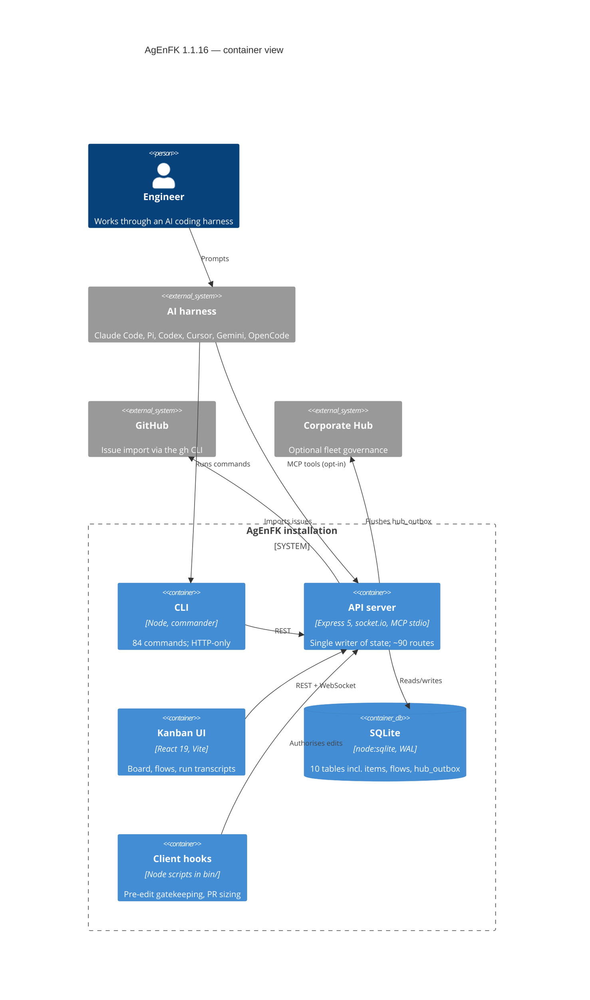
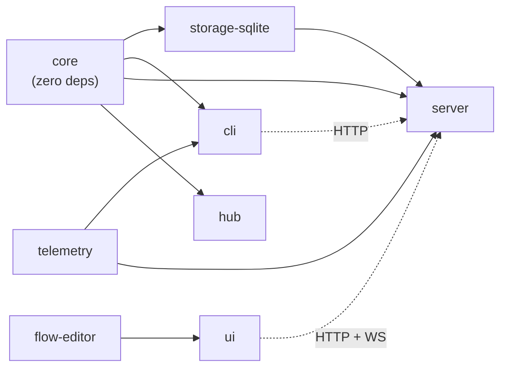

# AgEnFK architecture and schema inventory — baseline 1.1.16

**Purpose.** Freeze the exact state of the repository before Autonomous Delivery
changes it, with file and line references, so that every later claim of "this already
exists" or "this is new" is checkable. This is the versioned form of implementation
plan §1 and satisfies the AD0 deliverable *"repository architecture/current-schema
inventory"* (spec §26).

**Baseline.** Commit `2b3761b6` (`chore: bump version to 1.1.16`), Node v22.23.1,
audited 2026-09-02/03. Line numbers are valid at that commit.

**Companion documents.** [`CONTRADICTIONS.md`](./CONTRADICTIONS.md) records where this
repository disagrees with the specification. [`../adr/`](../adr/) records what was
decided about each disagreement.

---

## 1. Packages

npm workspaces, TypeScript `strict` everywhere. `tsc` → CommonJS for
`core`/`storage-sqlite`/`telemetry`/`cli`/`server`/`hub`; Vite + React 19 + Tailwind 4
for `ui`/`hub-ui`; `flow-editor` is consumed as raw TypeScript source.

| Package | src LOC | Test files | Runtime dependencies | Role |
|---|---:|---:|---|---|
| `core` | 1,219 | 10 | **none** | Domain types, gatekeeper, default flow, sizing, semver, project hygiene |
| `storage-sqlite` | 763 | 5 | `uuid` | The single `SQLiteStorageProvider` class |
| `telemetry` | 225 | 2 | `posthog-node` | Port discovery (`getApiUrl()`), installation id, opt-in telemetry |
| `cli` | 4,964 | 42 | `@agenfk/core`, `@agenfk/telemetry`, `axios`, `chalk`, `commander`, `figlet`, `inquirer`, `uuid` | The canonical command surface; HTTP-only against the server |
| `server` | 7,674 | 68 | `@agenfk/core`, `@agenfk/storage-sqlite`, `@agenfk/telemetry`, `@modelcontextprotocol/sdk`, `axios`, `body-parser`, `cors`, `express`, `socket.io`, `uuid`, `zod` | REST + WebSocket API and stdio MCP server; **the only writer of state** |
| `ui` | 6,703 | 21 | React 19, Vite, Tailwind 4, TanStack Query, socket.io-client, mermaid, … | Kanban board. Note: does **not** depend on `@agenfk/core` |
| `flow-editor` | 1,970 | 3 | consumed as source by `ui` | Flow editing component |
| `hub` | 7,033 | 63 | `@agenfk/core`, `express` (v4), `bcryptjs`, `jsonwebtoken`, `jwks-rsa`, `pg` | Optional Corporate Hub |
| `hub-ui` | 5,616 | 27 | React | Hub console |
| `create` | 0 | 0 | — | Project scaffolder (templates only) |
| `brand` | 0 | 0 | — | Design tokens only |

`core` having zero dependencies and importing no Node built-ins is load-bearing, not
incidental: it is what lets policy code be imported from any environment. ADR-0001 D2
makes it a rule.

## 2. Container view

## 3. Package dependency direction

Arrows point from dependency to dependent. Nothing points *into* `core`. Spec §31
requires that this stays true; ADR-0001 D10 makes it a compliance check.

## 4. Storage

Engine: **`node:sqlite`'s `DatabaseSync`** — a Node built-in, synchronous, requiring
Node ≥ 22.5 — obtained via `require()` to avoid ESM/CJS interop issues in the compiled
output (`packages/storage-sqlite/src/index.ts:25`). Three documents claimed
`better-sqlite3`; see [C1](./CONTRADICTIONS.md#c1--storage-engine-better-sqlite3-vs-nodesqlite).

WAL is enabled in `init()` (`:36`, PRAGMA at `:46`). Because writes land in the WAL
file rather than the main database file, callers must not use `fs.watch()` on the main
file to detect writes — the code says so at `:43-45`.

| Table | Line | Notes |
|---|---:|---|
| `projects` | `:64` | `id`, `data` (JSON blob) |
| `items` | `:68` | `id`, `project_id`, `type`, `status`, `parent_id`, `data`; indexed on project/status/parent |
| `snapshots` | `:79` | One `PauseSnapshot` per item; indexed on `item_id` |
| `flows` | `:86` | `id`, `data` |
| `hub_outbox` | `:90` | `event_id`, `occurred_at`, `payload`, `attempts`, `last_error` |
| `token_events` | `:99` | Per-turn telemetry; unique dedup index on `(client, source_path, source_offset)` |
| `ingestion_state` | `:121` | Resume offsets for the session-log ingestion worker |
| `prs` | `:126` | Agent-declared PR sizing plus a server-computed shadow |
| `agent_runs` | `:139` | Worker transcript per flow step |
| `run_events` | `:156` | Ordered events within a run |

Comments, history, tests and reviews are **not** tables — they live inside the
`items.data` JSON blob (`packages/core/src/types.ts:190`, `:193`).

**No migration framework.** Schema is created by `CREATE TABLE IF NOT EXISTS` on every
`init()`; there is one ad-hoc routine (`migrateFlowsTable()`, `:231`, called from
`:171`); there is no version table; and the only transaction in the package is a
hand-written `BEGIN`/`COMMIT` string with no `ROLLBACK` (`:239`, `:244`).
See [C2](./CONTRADICTIONS.md#c2--transactional-migrations-required-none-exist) and ADR-0002.

## 5. Domain model (`packages/core/src/types.ts`)

| Type | Line | Notes |
|---|---:|---|
| `Status` | `:1` | 10 values including `PAUSED`, `BLOCKED`, `ARCHIVED`, `TRASHED` |
| `ItemType` | `:14` | EPIC / STORY / TASK / BUG |
| `TokenEvent`, `TokenEventQuery`, `IngestionState` | `:33`, `:52`, `:61` | Session-log ingestion |
| `AgentRun`, `RunEvent`, `AgentRunQuery` | `:72`, `:90`, `:103` | Worker transcripts; `RunActor` = orchestrator \| worker \| reviewer |
| `Pr`, `PrSizing` | `:119`, `:112` | PR sizing |
| `Project` | `:170` | `verifyCommand`, `flowId`, `projectRoot` |
| `BaseItem` | `:181` | Includes `branchName`, `prUrl`, `implementationPlan`, `sortOrder` |
| `Flow`, `FlowStep` | `:259`, `:246` | `exitCriteria`, `isAnchor`, hub reconciliation fields |
| `PauseSnapshot` | `:275` | Free-text `summary` + `resumeInstructions`, one per item |

`Project.projectRoot` exists on the type but is not settable through any CLI path —
[C12](./CONTRADICTIONS.md#c12--no-cli-path-binds-a-project-to-a-directory).

## 6. Server

`packages/server/src/server.ts` is **3,928 lines** with ~90 routes registered inline.
There are no router modules.

| Concern | Location |
|---|---|
| `app` / `httpServer` / `io` created as module-level singletons | `:55-57` |
| `VERIFY_TOKEN` read from `~/.agenfk/verify-token` | `:24` |
| Bind host (`AGENFK_HOST`, default `127.0.0.1`) | `:42` |
| Requested port (`AGENFK_PORT`); actual port written to `~/.agenfk/server-port` | `:67`, `httpServer.listen` at `:3903` |
| CORS, then body parsers (50 mb limit) | `:71`, `:76-77` |
| First route (`GET /`) | `:905` |
| `GET /version` → `getCurrentVersion()` | `:926`, `:3704` (module-private) |
| `GET /db/status` | `:944` |
| Storage init; dbPath precedence env → `~/.agenfk/config.json` → default | `:566-571` |
| `asyncHandler` (forwards rejections to `next`) | `:790` |
| Last route (`GET /releases/latest`) | `:3822` |
| WebSocket connection handler | `:3869` |
| Exports | `:3928` (`initStorage`, `storage`, `performBackup`) |

**Route prefixes:** `/`, `/api/readme`, `/api/telemetry/config`, `/version`,
`/db/status`, `/backup`, `/projects`, `/flows`, `/prs`, `/token-events`,
`/agent-runs`, `/items`, `/registry/flows`, `/internal/hub`, `/jira`, `/github`,
`/releases`. Bare paths dominate: ~85 routes bare, 2 under `/api/`. `/v1/` appears only
in *outbound* Hub client calls (`:684`, `:758`, `:1129`, `:1163`).

**Authentication.** Local bind plus a shared `x-agenfk-internal` token, checked
**inline in 10 handlers** (`:959`, `:1030`, `:2154`, `:2815`, `:2824`, `:2879`, `:2891`,
`:2901`, `:2919`, `:2935`) — there is no auth middleware. There is also no global 404
handler and no error-handling middleware; 404s are produced per route.
See [C16](./CONTRADICTIONS.md#c16--the-router-module-convention-has-no-precedent-in-the-codebase).

**Realtime.** socket.io events `items_updated`, `flow:updated`, `run:updated`,
`run:event`, `project_switched`.

**In-memory state.** `validateRuns` and `activeValidateRunByItem` are plain `Map`s,
lost on restart — the closest existing analogue to a write lease, and why ADR-0003 D3
requires leases to be persisted.

**MCP surface.** `packages/server/src/index.ts:120` creates the MCP `Server`; the tool
list is an inline array inside the `ListToolsRequestSchema` handler (`:221`); dispatch
is a `switch` in `callToolHandler` (`:654`), wired at `:1126`. There is no named
constant listing tool names. Zod schemas for tool input live at `:133-220`; `zod` is
imported at `:11` and is declared only by `packages/server` (`^3.22.4`, installed
3.25.76).

## 7. Workflow engine

Items move through a configurable `Flow` of `FlowStep`s (default TODO → IN_PROGRESS →
REVIEW → TEST → DONE; per-project flows override it).

- `workflow_gatekeeper` (in `core`) is the pre-edit authorisation check and surfaces the
  active step's `exitCriteria`.
- Forward transitions are gated by `validate_progress` (`POST /items/:id/validate`),
  which runs asynchronously, records evidence as comments and `item.tests[]`, and emits
  hub outbox events.
- DONE is unreachable through `update_item({ status: "DONE" })` — the server blocks it;
  only `validate_progress` on the final step can land it.
- On DONE the handler runs `autoGitCommit` — `git add -A && git commit` — inside the
  request, but only when the project has opted in (`project.autoGitCommit`, off by
  default) and only when the project root is itself a git toplevel. See
  [C5](./CONTRADICTIONS.md#c5--autogitcommit-races-parallel-worktrees).
- `packages/server/src/project-root.ts` is the single project-root resolver: a
  `.agenfk` marker counts only at or below the caller's git toplevel, and
  `os.homedir()` never counts. `server.ts` and `index.ts` both use it.

## 8. CLI

`commander`, HTTP-only against the server, **84 top-level commands**.

| Command | Line | Why it matters here |
|---|---:|---|
| `pause <platform>` | `packages/cli/src/index.ts:1276` | Integration toggle — **must not change** (spec §5.1, §28) |
| `resume <platform>` | `:1310` | Integration toggle — **must not change** |
| `pause-work <id>` | `:1607` | Item snapshot |
| `resume-work <id>` | `:1634` | Item snapshot; pops the snapshot and restores status |
| `health` | `:1731` | Checks API, DB, OpenCode MCP config, global skills |
| `skills` | `:2665` | `install` / `uninstall` / `status` only |
| `branch` | `:3342` | `create` fails on leaf items — [C11](./CONTRADICTIONS.md#c11--branches-cannot-be-registered-on-leaf-items-open) |

No `execution`, `project`, `scheduler`, `agent`, `runtime`, `verification`, `budget` or
`release` namespaces exist. `skills registry` does not exist. These are reserved by
T03's collision suite before anything claims them.

Port discovery: `getApiUrl()` (`packages/telemetry/src/serverPort.ts:68`) resolves
`AGENFK_API_URL` → `~/.agenfk/server-port` → `AGENFK_PORT`/`PORT` →
`http://localhost:3000`.

## 9. Modes and client enforcement

Standard Mode (`commands/agenfk.md`) and Deep Mode (`commands/agenfk-deep.md`) are
**prompt-driven**. Deep Mode's supervisor spawns one sub-agent per flow step through the
harness `task` tool, each gated by `agenfk gatekeeper`.

Six clients are supported. Claude Code, OpenCode and Pi get mechanical pre-edit
blocking through their hook systems; Codex, Gemini and Cursor are instructional, backed
by the server-side gatekeeper audit trail. All six get the post-tool PR-sizing hook.
The full matrix is in [`../../AFK_ARCHITECTURE.md`](../../AFK_ARCHITECTURE.md).

## 10. Configuration

Resolution is **per-consumer, not centralised**. `~/.agenfk/config.json` is read in
three places in `server.ts` (`:571` dbPath, `:3122` jira, `:3567` github repos) and
written by the CLI's `config set`. `~/.agenfk/hub.json` has its own loader with env
overrides (`packages/server/src/hub/hubClient.ts:12`, `:25`).

Known `config.json` keys: `telemetry`, `flowRegistry`, `dbPath`, `jira`, `github.repos`.
Roughly 25 `AGENFK_*` environment variables exist; none begins with `AGENFK_FEATURE`.

**There is no feature-flag mechanism.** T02 adds the first one.

## 11. GitHub, Hub, CI

- **GitHub** is import-only, via the `gh` CLI, across three routes.
- **Hub** uses `hub_outbox` plus `packages/server/src/hub/flusher.ts` (batches of 500,
  backoff, halts after 5 consecutive 4xx). There is **no redaction layer** beyond
  remote-URL and DSN sanitising — [C6](./CONTRADICTIONS.md#c6--no-redaction-layer-on-the-hub-outbox).
- **CI**: `ci.yml` (npm ci → build → test), `codeql.yml`, `release.yml` (dispatch),
  `hub-image.yml`.

## 12. Tests

Vitest, `environment: 'node'`, `fileParallelism: false` and `sequence.concurrent:
false` because tests share filesystem state (`vitest.config.ts`). Timeouts are raised to
30 s for both tests and hooks to absorb CPU contention.

- **241 test files** total: server 68, hub 63, cli 42, hub-ui 27, ui 21, core 10,
  storage 5, flow-editor 3, telemetry 2.
- Integration tests use supertest against the real Express app plus a temp SQLite
  database, selected with `process.env.AGENFK_DB_PATH` before calling the exported
  `initStorage()`.
- Coverage gate: 80% statements/branches/functions/lines over `core`,
  `storage-sqlite`, `server`, `hub`.
- **Excluded from the root run:** `packages/ui/src/test/**` and
  `packages/cli/src/test/cli.test.ts`. The latter is run by nothing at all —
  [C18](./CONTRADICTIONS.md#c18--the-cli-test-named-by-the-card-would-never-run).
- There is **no browser e2e** — [C9](./CONTRADICTIONS.md#c9--designvisual-evidence-with-no-browser-e2e).

## 13. Foundation gate (Durable Execution D1–D5) — status at baseline

| Capability | Status | Closest analogue |
|---|---|---|
| D1 first-class `Execution` attached to an Item | **missing** | `AgentRun` — transcript only, no lifecycle or ownership |
| D2 typed `Checkpoint` + automatic checkpoints at boundaries | **missing** | `PauseSnapshot` — free-text, manual, one per item |
| D3 one write lease per Item | **missing** | `activeValidateRunByItem` — in-memory, one endpoint |
| D4 worktree binding + non-destructive drift detection | **missing** | `branchName` string on any item (C11); the gatekeeper reads worktree state but binds nothing |
| D5 portable resume packet + `agenfk execution resume` | **missing** | `resume-work <id>` |

**0 of 5 present.** Spec §5's gate therefore fails at baseline, and no writable
autonomous worker may be launched. T03 makes this machine-checkable; T04–T08 close it.
The companion specification that spec §5 calls authoritative does not exist —
[C19](./CONTRADICTIONS.md#c19--the-companion-spec-is-authoritative-and-absent).

## 14. Baseline verification

| Check | Result |
|---|---|
| `npm ci` | exit 0 |
| `npm run build` | exit 0, all packages |
| `npm test` | exit 0 — **219 files, 2,368 passed, 1 skipped** |
| Coverage gate | enforced at 80% by `vitest.config.ts` |

Wall time is machine-dependent and is **not** part of the baseline: the same suite has
been observed at 407 s, 924 s and 1,086 s on this machine. One hub test
(`admin-installations.test.ts`) is a load-sensitive flake, filed as BUG
`ed5535ae-4bfd-4a78-b083-ae110545b98a` and not fixed here.

## 15. What AD0 adds on top of this baseline

T02 (this task) adds documentation, three ADRs, an off-by-default feature-flag
resolver in `core`, the first router module (`/v1/capabilities`), and flag reporting in
`agenfk health`. **No orchestration behaviour, no schema change, no new dependency.**

> **Line-number caveat.** Every reference above is valid at the `2b3761b6` baseline, which
> is the point of this document. T02's own change mounts the capabilities router into
> `server.ts` at `:931`, so on the T02 branch and afterwards **every `server.ts` reference
> beyond `:927` has shifted by +10** (`getCurrentVersion` `:3704` → `:3714`, the last route
> `:3822` → `:3832`, the socket handler `:3869` → `:3879`, the exports `:3928` → `:3938`).
> Later tasks that move these lines again should append to this note rather than rewrite the
> baseline table, so the drift stays auditable.

T03 adds the migration framework (ADR-0002), the machine-checkable foundation gate,
`agenfk project doctor`, the CLI namespace-collision suite and the Standard/Deep
backwards-compatibility suite.
